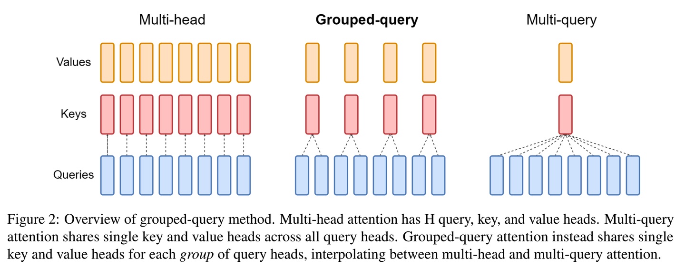

# Attention

# 基础Attention 

> 输入为一个长为L的句子，然后经过一系列层，他变为n这个维度
>
> 具体流程详见[句子编解码笔记](../句子编解码/句子编解码.md)

Attention是根据输入的矩阵$input \in R^{L \times n}$去计算一个不同位置之间的关系得到一个，形成一个不同位置之间的关系的矩阵Attentionscore $\in R^{L \times L}$,  最后与当前 value 相乘得到加权后的上下文表示。
$$
Attention = softmax(\frac{Q*K^T}{\sqrt{d_key}})V , Attention \in R^{L \times n}, d_{k} 是 Key 的维度
$$

```python
class Attention:
    """
     初始化Attention层
        
     参数:
     - input_dim: 输入特征的维度 (n)
     - d_model: 模型隐藏层维度
     - d_k: Query和Key的维度
     - d_v: Value的维度
    """
  def __init__(self, input_dim, d_k, d_v):
    self.input_dim = input_dim
    self.d_k = d_k
    self.d_v = d_v
    self.w_q = nn.Linear(input_dim, d_k)
    self.w_k = nn.Linear(input_dim, d_k)
    self.w_v = nn.Linear(input_dim, d_v)
    
	def selfAttention(self, input):
    Q = self.w_q(input) # 维度变为b*L*d_k
    K = self.w_k(input) 
    V = self.w_v(input) 
    Attention_scores = F.softmax(torch.matmul(Q, k.transpose(1,2))/math.sqrt(self.d_k), dim = -1) # 维度b*L*L 这里去根据 , softmax可以帮助每行和为一
    selfAttention = torch.matmul(Attention_scores, V)# 维度变为b*L*d_k
    return selfAttention
  
  def crossAttention(self, query, key):
    Q = self.w_q(query)
    K = self.w_k(key) 
    V = self.w_v(key) # key 和 value来自编码器，Q来自解码器
    Attention_scores = F.softmax(torch.matmul(Q, k.transpose(1,2))/math.sqrt(self.d_k), dim = -1) # 维度b*L*L 这里去根据 , 与每一个key都有一个相关数，最后需要拼摊
    Attention = torch.matmul(Attention_scores, V)# 维度变为b*L*w
    return Attention
  
  def selfAttention_mask(self, input):
    
```

==Q1:为什么需要除以$\sqrt(d)$==

简单来说，就是需要压缩softmax输入值，以免输入值过大，进入了softmax的饱和区，导致梯度值太小而难以训练

为什么不除平均值or其他

Q2:w_q建议是扩维还是降维

# MHA（Multihead Attention）

也就是同时需要去计算多个注意力机制，去学习不同维度的信息，最后拼接在一块。

Notes:headi是先投影到低维子空间，再切头，而不是“一个头一个全维投影”

Q → [batch, seq_len, d_model]
→ 拆成 h 个 [batch, seq_len, d_k]
→ 并行计算 attention
→ concat → 再线性映射
$$
MultiHeadAttention(Q, K, V) = concat(head1,\dots,head_n)\\
head_i = Attention(W^Q·Q,W^K·K,W^V·V)
$$


多头注意力的好处：

简单来说就是（1）每个头确实学到东西有所不同，但大部分头之间的差异没有我们想的那么大（比如一个学句法，一个学词义这样明显的区分）（2）多个头的情况下，确实有少部分头可以比较好地捕捉到各种文本信息，而不会过分关注自身位置，一定程度缓解了上文提到的计算 之后对角线元素过大的问题。

目前可以看到的趋势是，模型越大（也就是hidden size越大），头数的增多越能带来平均效果上的收益（或者说允许注意力头增大而不影响子空间的学习能力）。

正如上述所描述一样，所以这里的d_k = d_model/h

```python
class MHA:
  def __init__(self, input_dim, d_model, h):
    self.d_k = d_model // h
    self.w_q = nn.Linear(input_dim, d_model)
    self.w_k = nn.Linear(input_dim, d_model)
    self.w_v = nn.Linear(input_dim, d_model)
    
  def calMHA(self, input):
    Q = self.w_q(input)
    K = self.w_k(input)
    V = self.w_v(input)#[batch_size, seq_len, h*d_k]
    # 拆分多头: reshape 为 [batch_size, seq_len, h, d_k]，然后转置
    # 目标: [batch_size, h, seq_len, d_k]
    Q = Q.view(batch_size, -1, self.h, self.d_k).transpose(1, 2)# [batch_size, seq_len, h, d_k]
    K = K.view(batch_size, -1, self.h, self.d_k).transpose(1, 2)
    V = V.view(batch_size, -1, self.h, self.d_k).transpose(1, 2)
    scores = torch.matmul(Q, K.transpose(-2, -1)) / math.sqrt(self.d_k)# [batch_size, seq_len, h, h]
    scores = F.softmax(scores, dim = -1)
    context = torch.matmul(attention_weights, V)  # [batch_size, h, seq_len_q, d_k]
    context = context.transpose(1, 2).contiguous()  # 先转置成 [batch_size, seq_len_q, h, d_k]
    context = context.view(batch_size, -1, self.d_model)  # 合并最后两维
    return context
    
    
```

根据以上的学习，我们发现，在这个过程之中，会产生巨大的scores的中间量，所以需要存储中间量很复杂、

# MQA

MQA就是来减少缓存所需要的量的。

其中，只将Q进行切分，类似MHA中所做的，K和V直接从d_model降低到d_head d_head == d_model // h

这会导致什么：1. Q和K乘积矩阵从$R \in [b, seq_l, h, h]$ 降低到 $R \in [b, seq_l, h, 1]$ 

但是,  简单来说，就是MHA中，每个注意力头的 、 是不一样的，而MQA这里，每个注意力头的 、 是一样的，值是共享的。而其他步骤都和MHA一样。


# GQA

GQA里， Q还是按原来MHA/MQA的做法不变。只使用一套共享的 K、V不是效果不好吗，那就还是多弄几套。但是不要太多，数量还是比 的头数少一些。这样相当于把 的多个头给分了group，同一个group内的 共享同一套 K、V，不同group的 所用的 K、V不同。




# ROPE


# Flash Attention

==背景==：传统需要计算 $$attention = softmax(QK^T)V$$, 这时候中间会产生一个巨大的矩阵，在SRAM中写不下，这时候会进行写入HBM的操作（很慢），也就引发带宽跟不上算力的问题，导致算力瓶颈

> HBM显存：容量大（几十GB），读写慢
>
> SRAM片上缓存：容量极大（几百kB），速度很快

==核心解决方法==

1. 分块（Tiling）：画整为零 （之前是一次性计算完全部庞大的矩阵存入内存）

   分块：Q按行切，K和V 按列切

   尺寸匹配：$$Q_{block}$$, $$K_{block}$$相乘获得的矩阵大小正好是SRAM的大小 好处是数据就在手边无需进行读写🤔

   ```
   while ：
   	for $$Q_{block}$$ in Q：
   		for $$K_{block}$$，$$V_{block}$$ in K，V：
   			 atten1 = softmax(Q_{block},K_{block}^T)V_{block}
   		
   ```

2. softmax -》safesoftmax -〉online softmax

   softmax
   $$
   softmax(x_i) = \frac{e^{x_{i}}}{\sum{e^{x_{i}}}}\ \ x_i\in x
   $$
   **弊端**：1. 你需要获取到全部矩阵，矩阵是没有办法存入到SRAM中的，所以需要进行HBM读写

   **手撕softmax函数**

   ```python
   X = torch.tensor([])
   def softmax(X):
     sum_x = x.exp().sum()
     result = X/sum_x
   	
   ```

   Safe softmax
   $$
   softmax(x_{block}) = \frac{e^{x_{block}}-m}{\sum{e^{x_{block}}-m}}\ \ x_{block}\in x,\ m是当前block的最大值
   $$


   safesoftmax与softmax的等价性	
$$
   \begin{aligned}
   \text{softmax}(x_{block}) 
   &= \frac{e^{x_{\text{block}} - m}}{\sum_{i=1}^{n} e^{x_{\text{block}} - m}} \\
   
   & = \frac{\frac{e^{x_{block}}}{e^m}}{\sum{\frac{e^{x_{block}}}{e^m}}}\\
   & = \frac{\frac{e^{x_{block}}}{e^m}}{\frac{\sum{e^{x_{block}}}}{e^m}}\\
   & =softmax(x_i)\\
   \text{其中 } & x_{\text{block}} \in x, \quad m = \max(x_{\text{block}})
   \end{aligned}
$$
   Online-safesoftmax

3. I/O感知内核

   计算attention方法 矩阵乘法-》缩法-〉mask —》softmax -〉矩阵乘法 统一合并为一个cuda kernel 中间产物无需读写，O(n^2)->O(n)

4. 重计算 Recomputational -》计算换带宽。训练过程中

   传统方法存下整个中间产物（Q，K，V）的庞大矩阵（forward正向计算过程中），再返回求积分的时候（back-propagation）继续使用，这里会进行大量的读写操作

   

   flash attention指存入m和d（🤔为什么只存这两个，为什么不一块去计算），到反向传播的时候重新来计算整个矩阵

==Flash Attention v1，v2，v3==

v1主要解决O(N^2)的显存站哟个问题，也就是说他提出了划分块进行计算的问题

v2强并行，提升了不同任务之间的分配逻辑

v3Hopper架构优化，利用H100上的TMA特性，可以一边算，一边把下一块数据读出/低精度加速（FP8）


#### 相关题目

- 介绍Flash Attention的原理和实现思路

- Flash Attention v2为什么外层对Q循环，Flash Decoding的combine kernel耗时占比大概是多少


# 
