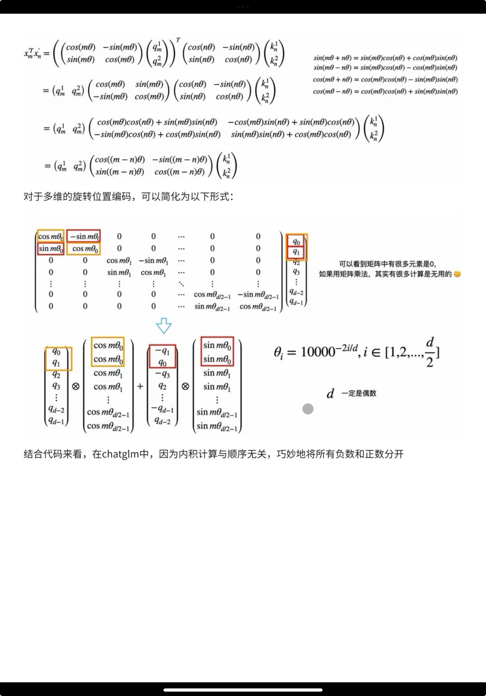
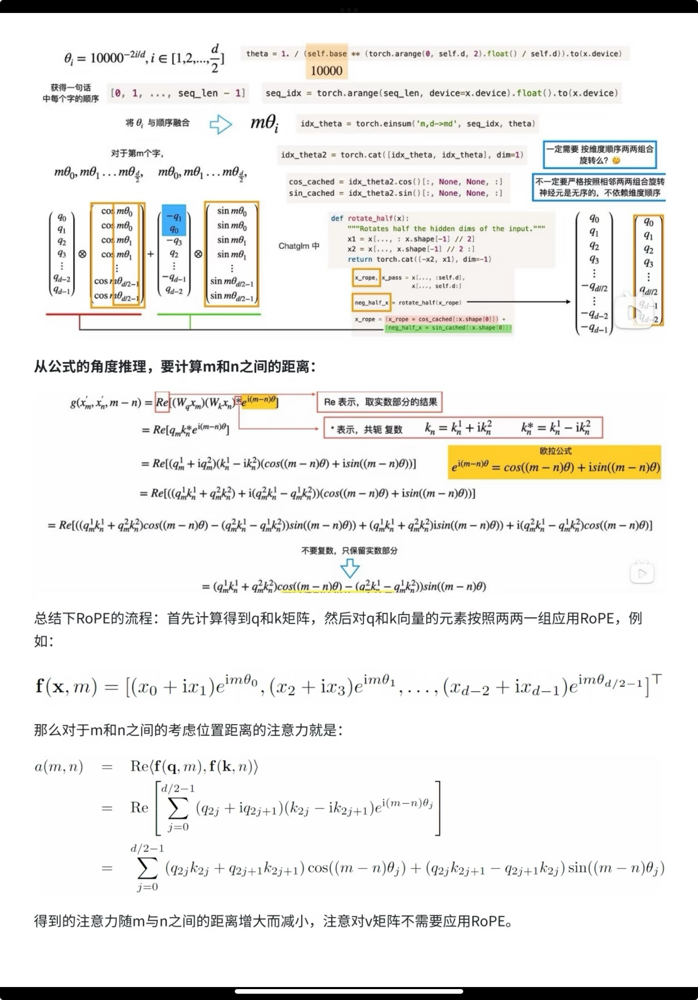

# 位置编码

# 绝对位置编码

将token的绝对位正弦余弦编码
$$
PE(pos,2i) = sin(\frac{pos}{10000^{2i/d_{model}}})\\
PE(pos,2i+1) = cos(\frac{pos}{10000^{2i/d_{model}}})
$$


这两个如何理解：

- 一列，也就是都处于pos =x时候，不同向量表达

  针对pos = 0 [sin0, cos 1, sin2 ,cos3] ，一条句子中

- 一航，同一个向量不同位置表达

  针对 i=0:   sin(pos) 可以表达第几个橘子

可以发现按照列，就是一个纯正弦波形


因此一个绝对位置的注意力权重可以表示为两个矩阵相乘（query，key）, p_t 是position embedding 

query 和 key的计算方式是
$$
q_t= W_Q·x_t \\
k_s = W_k·x_s
$$
Query 和 key 都具有位置信息p_t 和 p_s
$$
\begin{align*}
A_{t,s}
&= q_t^\top k_s \\[4pt]
&= (x_t + p_t)^\top W_Q^\top W_K (x_s + p_s) \\[4pt]
&= x_t^\top W_Q^\top W_K x_s
 + x_t^\top W_Q^\top W_K p_s
 + p_t^\top W_Q^\top W_K x_s
 + p_t^\top W_Q^\top W_K p_s
\end{align*}
$$


# 相对位置编码

相对位置信息添加到attention中，也就是他与前后的关系

- Attention with linear biases enable input length extrapolation（ALiBi）

  对前面的位置进行惩罚
  $$
  A =A_{t,s}+
  \begin{bmatrix}
  0 & 0        & 0        & 0        & 0 \\
  -1       & 0   & 0   & 0  & 0 \\
  -2       & -1   & 0   & 0   & 0 \\
  -3      & -2   & -1   & 0   & 0 \\
  -4       & -3   & -2   & -1   & 0
  \end{bmatrix} * m
  $$
  对于之前位置信息，强制的加入一个惩罚信息，会让模型更关注附近知识信息的学习（平衡了局部和全局的学习），而且他的这种线性惩罚很容易进行扩展

- XLENT

  就是将原来的p_s,  也就是key 携带相对位置信息$R_{i-j}$ , 而 query的位置变成单位向量，通俗理解, $[3,4] =[u,v]· [3,4]^T$
  $$
  R_{i-j} = [..., sin(\frac{p_j-p_j}{10000^{2i/d_{model}}}), cos(\frac{p_j-p_j}{10000^{2i/d_{model}}}),...] ^T
  $$

- T5

  qk相乘的结果可以理解为 输入/输入 、输入/位置、位置/输入、位置/位置，输入信息和位置信息应该是毫无关系，也就是cos90 = 0

  

$$
\begin{align*}
A_{t,s}
&= q_t^\top k_s \\[4pt]
&= (x_t + p_t)^\top W_Q^\top W_K (x_s + p_s) \\[4pt]
&= x_t^\top W_Q^\top W_K x_s
 + x_t^\top W_Q^\top W_K p_s
 + p_t^\top W_Q^\top W_K x_s
 + p_t^\top W_Q^\top W_K p_s\\[4pt]
&= x_t^\top W_Q^\top W_K x_s + 0 + 0 + p_t^\top W_Q^\top W_K p_s
\end{align*}
$$

​	位置与位置，也就是t向量和s向量之间的一个东西可以单独去算


```python
def _relative_position_bucket(relative_position, bidirectional=True, num_buckets=32, max_distance=128):
    """
    Adapted from Mesh Tensorflow:
    https://github.com/tensorflow/mesh/blob/0cb87fe07da627bf0b7e60475d59f95ed6b5be3d/mesh_tensorflow/transformer/transformer_layers.py#L593

    Translate relative position to a bucket number for relative attention. The relative position is defined as
    memory_position - query_position, i.e. the distance in tokens from the attending position to the attended-to
    position. If bidirectional=False, then positive relative positions are invalid. We use smaller buckets for
    small absolute relative_position and larger buckets for larger absolute relative_positions. All relative
    positions >=max_distance map to the same bucket. All relative positions <=-max_distance map to the same bucket.
    This should allow for more graceful generalization to longer sequences than the model has been trained on

    Args:
        relative_position: an int32 Tensor
        bidirectional: a boolean - whether the attention is bidirectional
        num_buckets: an integer
        max_distance: an integer

    Returns:
        a Tensor with the same shape as relative_position, containing int32 values in the range [0, num_buckets)
    """
    relative_buckets = 0
    if bidirectional:
        num_buckets //= 2
        relative_buckets += (relative_position > 0).to(torch.long) * num_buckets
        relative_position = torch.abs(relative_position)
    else:
        relative_position = -torch.min(relative_position, torch.zeros_like(relative_position))
    # now relative_position is in the range [0, inf)

    # half of the buckets are for exact increments in positions
    max_exact = num_buckets // 2
    is_small = relative_position < max_exact

    # The other half of the buckets are for logarithmically bigger bins in positions up to max_distance
    # bucket = floor(
  #     log(rel_pos / max_exact)
  #     / log(max_distance / max_exact)
  #     * (num_buckets - max_exact)
  # )
    relative_position_if_large = max_exact + (
        torch.log(relative_position.float() / max_exact)
        / math.log(max_distance / max_exact)
        * (num_buckets - max_exact)
    ).to(torch.long)
    relative_position_if_large = torch.min(
        relative_position_if_large, torch.full_like(relative_position_if_large, num_buckets - 1)
    ) 
    relative_buckets += torch.where(is_small, relative_position, relative_position_if_large)
    return relative_buckets
```


- DeBERTa

  xxxxx
  
  
  
  

 【结论】

**绝对位置编码**：每个位置有固定表达，语义直观；但训练长度受限，超出长度泛化差，对外扩展不够灵活（尤其可学习绝对编码）。

**相对位置编码（如 T5）**：建模 token 间距离关系，对外长度泛化更好、更灵活；但像 T5 这类方法会对远距离做分桶压缩，超远距离的位置精细信息会被弱化。

> sinusoidal 绝对位置编码在公式上可以随时算出任意 pos 的向量，但模型参数只在训练长度内学习过如何“理解”这些位置信号；超出训练长度后，新算出的位置向量对模型来说是未见过分布的输入，导致位置感知和外推效果退化，因此在对外长度扩展上被认为不够灵活。

# ROPE


ROPE实现了相对编码和绝对编码的的效果

将输入序列的信息通过旋转信息通过旋转操作嵌入，（0，2pie）咋都见过了

之前因为相对位置信息无法随时学到，rope在自注意力公式中结合了明确的相对位置依赖性

先复习一下欧拉公式：
$$
e^{ix} = \cos x + i\sin x
$$

因此，任意复数可以表示为

$$
z = x + iy = |z|(\cos\theta + i\sin\theta) = |z| e^{i\theta}
$$

其中 $\tan\theta = \dfrac{y}{x}$。

也就是每一纬度特征向量$\boldsymbol{x}_m = \mathbf{x_m} e^{i m \theta}$ ,\mathbf{x_m} 也就是｜z｜
$$
\begin{aligned}
\boldsymbol{x_m}
&= W_q \mathbf{x_m} e^{i m \theta} \\[6pt]
&= 
\begin{pmatrix}
W_q^{11} & W_q^{12} \\
W_q^{21} & W_q^{22}
\end{pmatrix}
\begin{pmatrix}
x_m^{(1)} \\
x_m^{(2)}
\end{pmatrix}
e^{i (m \theta)} \\[6pt]
&= \begin{pmatrix}
q_m^{1} \\
q_m^{2}
\end{pmatrix} e^{i(m \theta)} \\[4pt]
&= (q_m^{1}+iq_m^{2})e^{i (m \theta)}\\[4pt]
&= (q_m^{1}+iq_m^{2})(cos(m\theta)+isin(m\theta))\\[4pt]
&=q_m^{1}cos(m\theta) -q_m^{2}sin(m\theta) + i(q_m^{1}sin(m\theta)+q_m^{2}cos(m\theta))\\[4pt]
&= 
\begin{pmatrix}
\cos(m\theta) & -\sin(m\theta) \\
\sin(m\theta) & \cos(m\theta)
\end{pmatrix}
\begin{pmatrix}
q_m^{1} \\
q_m^{2}
\end{pmatrix}
\end{aligned}
$$


计算两个向量的内积 Q^T·K
$$
\begin{aligned}
\mathbf{q}_m^\top \mathbf{k}_n
&=
\begin{pmatrix}
q_m^{1} & q_m^{2}
\end{pmatrix}
\begin{pmatrix}
\cos(m\theta) & -\sin(m\theta) \\
\sin(m\theta) & \cos(m\theta)
\end{pmatrix}^\top
\begin{pmatrix}
\cos(n\theta) & -\sin(n\theta) \\
\sin(n\theta) & \cos(n\theta)
\end{pmatrix}
\begin{pmatrix}
k_n^{1} \\
k_n^{2}
\end{pmatrix}
\end{aligned}
$$






