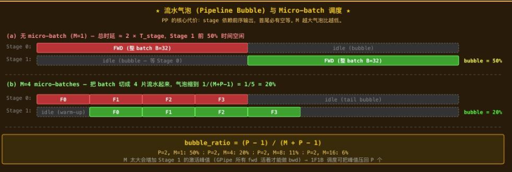
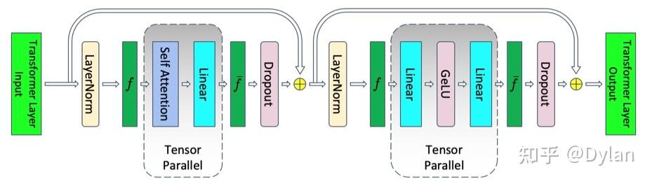
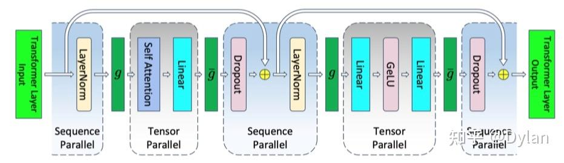

# 5p推理

https://zhuanlan.zhihu.com/p/2035106376138085860

本文覆盖推理场景的 7 种并行策略：**TP、PP、DP、EP、DP Attention、SP、CP。**

按切分维度分为四组：

- **Weight（参数维度）**：TP、EP
- **Batch（样本维度）**：DP、DP Attention
- **Sequence / Context（序列维度）**：SP、CP
- **Layer（深度维度）**：PP


平行主要涉及三个方面的东西：放得下，跑的快，通信不达瓶颈

一批seq的维度是[B,S,hidden],所以需要短句子长句子去padding成同一长度

# TP（Tensor parallel）

**简单记为：**权重矩阵按维度切到多卡，出口 通过allreduce合并，也就是dim =-1上切分

张量并行是指对模型==内部的参数矩阵==切分，然后利用分块矩阵乘进行计算得到正确结果，由于参数矩阵是以tensor表示，故叫张量并行

**好处**

- 权重、KV cache、TP 区域激活按 N 等分，线性降显存
- Prefill 阶段计算量也按 N 等分，扩算力

**代价**

- 每层 2 次 AllReduce（Attention 后 + MLP 后），对带宽极敏感
- 必须在 [NVLink](https://zhida.zhihu.com/search?content_id=274277475&content_type=Article&match_order=1&q=NVLink&zhida_source=entity) 域内（跨 IB 效率个位数），通常 **TP ≤ 8**
- Decode S=1 时 AllReduce 延迟主导
- TP > num_kv_heads 时要复制 KV head（KV cache 放大）

> 模型配置 h = 8192 n_heads = 64 d_heads = 128 S=2000 B =32 TP = 4 单机四卡
>
> **计算一次TP的全流程：**
>
> 1. x输入维度[32, 2000, 8192]
> 2. 切分到四张卡上去做QKV，每一个卡上的w矩阵进行等分（wq/wk/wv/w1 按列切分｜ wo/w2 按行切分）
>    - 
> 3. allreduce
> 4. LN+residual
> 5. mlp up（列切分）
> 6. mlp down（行切分）
> 7. allreduce
> 8. output 输出维度[32，2000，8192]
>
>
> x = [32,2000,8192] -->每卡有完整副本
> 1.计算QKV 正常全量产出 [32,64,2000,128]->切分让每一张卡去计算64/4个头，最后直接拼接
> 		=》单卡产出：[32,16,2000,128]
>   q = x·wq $ wq\in[8192,8192] $
>   实现方式：每卡有全部x，但是w为1/4列 w \in [8192,2048]，然后进行第一次allreduce逐元素求和。


==使用行列切分相结合的好处==

# PP（Pipline parallel）

**简单记为：**按layer把模型切到多张卡，每一层layer不切 --- **只在 stage 边界 P2P 传一次激活**——用最小通信换”装下超大模型”。

**好处**

- **通信量最小**：只在 stage 边界 P2P 传一次激活，远小于 TP 的每层 AllReduce
- **跨机最友好**：不依赖 NVLink，普通 IB / 以太网也能跑
- 把参数切到”深度”维度，单机装不下的超大模型首选维度
- Prefill 阶段 micro-batch 可流水填满，吞吐近 N×

**代价**

- **流水气泡**：stage 串行依赖，首尾必有空等;靠 micro-batch 摊平，但 decode 难做大 M
- **Decode 单请求延迟 = P 段之和**：token 必须串行穿过所有 stage，PP 不降低延迟
- **stage 切分需手工平衡**：每段 FLOPs / 参数量接近才能填满流水
- 显存各 stage 不均衡（embedding、lm_head 偏重，KV cache 按层摊到各 stage）

> 前n层layer在gpu0上，后m层在gpu1上
>
> 所以传输只涉及gpu0之后的的outputs维度，每一个gpu需要存储他负责layers部分的全部参数，全部流程：
>
> - GPU0跑16层MHA+1层mlp
> -  GPU1在跑16层MHA+1层MLP
>
> 引发问题，gpu1在接到gpu0之前时需要完全等待，GPU 处于 idle意味着服务器利用率低 / 吞吐下降，micro-batch可以解决这类问题
>
> $bubble\_{ratio} = \frac{PP - 1}{M + P - 1}$, where PP is Pipeline parallel, M is micro-batch
>
> 
>
> 


# DP（data parallel）

**简单记为：**解决数据量过大，针对于一个机器多张卡的概念，切分是针对dim = 0，针对batch进行切分，因此每一张卡需要全部模型，

卡间不需要相互通信

**好处**

- 实现最简（SPMD，不切权重），跨机友好
- 吞吐 ×N 线性扩展，单请求延迟 = 单卡延迟
- 是 DP Attention 的”宿主维度”：`dp_size > 1` 才能开 DP Attention（见 §5）

**代价**

- 每卡放完整权重 + 完整 KV cache，**N 卡总显存 = N × 单卡**
- 单卡装不下模型时 DP 不能单独用，必须叠 TP/PP/EP
- 请求绑 rank，热/冷不均无法动态再平衡

**两种dp**
- pytorch dp： 单进程多线程，主卡做scatter/gather，存在GIL和负载不均
- pytorch ddp：多进程，每个进程一个GPU，使用NCCL在后端做all-reduce

notes: 
- 为什么ddp比dp快？
dp需要主卡先将数据scatter到其他卡上，然后等forward完成，再reduce所有梯度，计算loss，主卡又算又传
除此之外，虽然gpu kernel不受限于GIL锁的影响，但是cpu调度会受到GIL的影响

- ddp梯度同步发生在backward哪一步？
每一层计算完梯度，会将当前梯度存入bucket，当bucket满的时候，就会触发梯度传输，这样可以再算的时候传输，完成时延掩盖


# EP（Expert Parallel）

**简单记为：**：MoE 模型里把 256 个 expert 分到 N 卡，每 MoE 层 dispatch + combine 两次 A2A。

**好处**

- MoE 专家本来互相独立，按专家切零耦合
- 支撑巨大总参数量（DeepSeek-V3 671B 总 / 37B 激活）
- 通信规整（双向 A2A），可用 DeepEP 等 backend 深度优化

**代价**

- 每 MoE 层 2 次 A2A，跨机带宽敏感
- 负载不均：热门 expert 堆压某 rank → 需 capacity factor / EPLB
- 小 batch 低效：每卡进 expert 的 token 太少 GEMM 跑不满
- 只适用 MoE 模型

# MP 


# SP（Sequence Parallelism，序列并行）

**简单总结：**针对长序列，也就是dim=1进行切分，相较于TP，额外多一次通信

**好处**

- 消除 TP 区域外（LN / Residual）的激活冗余 → 单层峰值激活 ÷ N
- 训练首选（激活要保留给反向，省的就是显存上限）
- 不引入新通信域（AG / RS 仍用 TP group）

**代价**

- 必须依附 TP，不是独立维度
- 通信次数 +1：`1× AR` 变 `1× AG + 1× RS`，字节数相同但 collective 多 1 次
- **推理收益小**（激活用完即丢），训练价值大

标准 Transformer 一层天然分两区：

```text
x → [LayerNorm] → [QKV → Attention → Out Proj] → [Residual] → 输出
        SP               TP                        SP
      只能按 S 切       可以按 H 切                只能按 S 切
```

**标准 TP 的漏洞**： 区每卡存完整 `[S, H]`，N 卡冗余 N 份。

**SP 的方案**：用和 §4.2 **同一个恒等式** `AllReduce ≡ ReduceScatter + AllGather`，但换一种拆法——把 TP 的每次 AR 拆成 **AG（TP 入口）+ RS（TP 出口）**，中间夹 TP 区，两侧留 SP 区只存 `[S/4, H]` 小激活：

```text
  [S/4, H] → LayerNorm → ⭐AG↗ →   [S, H]
  [S, H] → QKV → Attn → OutProj → partial [S, H] → ⭐RS↘ →   [S/4, H] → Res
  
  
  
  
  
  
```


如下针对一个transformer block 制作TP和TP+SP的流程对比





- 
- 什么是5d并行

5D 并行是大模型超大规模训练的混合并行范式，核心是在 3D 并行（数据 DP + 张量 TP + 流水线 PP）基础上，加入**序列并行 SP**与**专家并行 EP**，形成 “数据、张量、流水线、序列、专家” 五个维度的协同拆分，目标是在千卡 / 万卡集群上高效训练万亿参数模型（含 MoE 架构），同时最大化显存利用率与算力效率。

| 维度              | 核心思想                                                     | 显存优化点                                          | 通信特点                                           | 典型适用场景                         |
| ----------------- | ------------------------------------------------------------ | --------------------------------------------------- | -------------------------------------------------- | ------------------------------------ |
| **数据并行 DP**   | 样本按 batch 拆分到多卡，各卡独立计算梯度后 All-Reduce 聚合  | 不减少模型显存，提升吞吐                            | 跨卡梯度同步，通信量与模型参数正相关               | 所有规模训练，与其他并行叠加         |
| **张量并行 TP**   | 单层权重 / 激活按维度切分（如 Linear 层按列拆分），多卡协同计算 | 单卡仅存单层部分权重，适配 Transformer 密集矩阵运算 | 节点内高带宽通信（NVLink），All-Reduce 合并输出    | 单节点多卡，规整模型层内拆分         |
| **流水线并行 PP** | 模型按层切分成 Stage，微批次流水线执行，计算与通信重叠       | 单卡仅存单个 Stage 权重，适配超深模型               | 跨节点激活传递，存在 “气泡” 需微批次填充           | 多节点多卡，超大规模模型（万亿参数） |
| **序列并行 SP**   | 长序列按 token 维度拆分，自注意力计算跨卡并行                | 降低长序列激活显存，突破序列长度限制                | 节点内 Ring-Attention 通信，通信量与序列长度正相关 | 长上下文模型（如 32k/64k 窗口）      |
| **专家并行 EP**   | MoE 模型中专家层拆分到多卡，激活仅路由到对应专家             | 单卡仅存部分专家权重，MoE 模型显存瓶颈突破          | 专家间激活路由通信，通信量与稀疏度负相关           | MoE 架构（如 GPT-4、Llama 3 MoE）    |


| 特性             | **模型并行（Model Parallelism）**                            | **张量并行（Tensor Parallelism）**                           | **流水线并行（Pipeline Parallelism）**                       |
| ---------------- | ------------------------------------------------------------ | ------------------------------------------------------------ | ------------------------------------------------------------ |
| **核心思想**     | 将**模型的不同组件**拆分到不同设备上，每个设备负责一部分网络层的计算 | 将**单个层的张量计算**拆分到不同设备上，按维度切分权重与激活值，并行完成矩阵运算 | 将**模型按层切分成多个阶段（Stage）**，每个设备负责一个阶段，按流水线方式顺序执行计算与通信 |
| **拆分粒度**     | 粗粒度：层间拆分（如 Transformer 的 Encoder Layer 1-10 在卡 0，11-20 在卡 1） | 细粒度：层内拆分（如一个 Linear 层的权重矩阵按列切分，分散到多卡） | 粗粒度：阶段拆分（如将 100 层 Transformer 拆成 10 个 Stage，每卡负责 10 层） |
| **计算逻辑**     | 单卡完成自身负责层的完整计算，层间传递激活值                 | 多卡协同完成同一层的计算，通过 All-Reduce 等操作聚合梯度 / 输出 | 多卡按流水线时序执行，前一卡计算完的激活值传递给后一卡，同时自身开始下一个 batch 的计算 |
| **通信开销**     | 低 - 中：仅在层间传递激活值 / 梯度，通信量与激活值大小正相关 | 高：层内计算需要频繁的 All-Reduce 通信，通信量与张量维度正相关 | 中 - 高：阶段间传递激活值，且存在 “气泡”（流水线空闲时间），通信量与阶段数正相关 |
| **显存优化核心** | 单卡仅存储**部分模型层**的权重、激活值、梯度                 | 单卡仅存储**单个层的部分权重**、激活值切片，大幅降低单卡显存占用 | 单卡仅存储**单个阶段**的模型权重、激活值，适合超深模型       |
| **典型适用场景** | 模型结构不规整（如含分支的 CNN）、中小规模模型跨卡拆分       | Transformer 类规整模型的训练 / 推理，单节点多卡场景          | 超大规模模型（万亿参数）的训练，多节点多卡场景               |