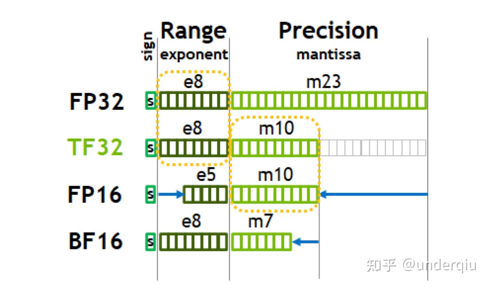
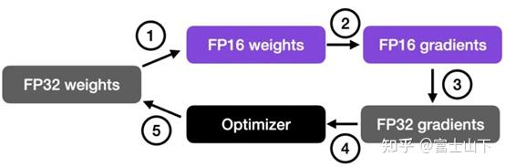

# 大模型精度：FP32、TF32、FP16、BF16、FP8、FP4、NF4、INT8

[浮点数精度](https://zhida.zhihu.com/search?content_id=258441959&content_type=Article&match_order=1&q=浮点数精度&zhida_source=entity)：双精度（FP64）、单精度（FP32、TF32）、半精度（FP16、BF16）、8位精度（FP8）、4位精度（FP4、NF4）

[量化精度](https://zhida.zhihu.com/search?content_id=258441959&content_type=Article&match_order=1&q=量化精度&zhida_source=entity)：INT8、INT4 （也有INT3/INT5/INT6的）

简而言之，用不同长度的二级制数字去表示一个数字

# 浮点精度

## 「FP」

Floating Point，是最原始的，IEEE定义的标准浮点数类型。由符号位（sign）、指数位（exponent）和小数位（fraction）三部分组成。

FP64，是64位浮点数，由1位符号位，11位指数位和52位小数位组成。

FP32、FP16、FP8、FP4都是类似组成，**只是指数位和小数位不一样**。但是FP8和FP4不是IEEE的标准格式。

其中FP8 有两种变体，E4M3(4位指数和3位尾数)和E5M2(5位指数和2位尾数)

## 「TF」

TF32，Tensor Float 32，英伟达针对机器学习设计的一种特殊的数值类型，用于替代FP32。首次在A100 GPU中支持。

由1个符号位，8位指数位（对齐FP32）和10位小数位（对齐FP16）组成，实际只有19位。在性能、范围和精度上实现了平衡。

## 「BF」

**BF16，Brain Float 16**，**由1个符号位，8位指数位（和FP32一致）和7位小数位（低于FP16）组成**，**但是表示范围和FP32一致，和FP32之间很容易转换。**

> [!IMPORTANT]
>
> 为什么bf16 和 TF32 的表示范围一致,  因为指数位一样
>
> 
> $$
> range = （-1）^ {sign} \times 2^{exponent} \times fraction
> $$

| 格式     | 符号位 | 指数位 | 小数位 | 总位数 |
| -------- | ------ | ------ | ------ | ------ |
| FP64     | 1      | 11     | 52     | 64     |
| FP32     | 1      | 8      | 23     | 32     |
| TF32     | 1      | 8      | 10     | 19     |
| BF16     | 1      | 8      | 7      | 16     |
| FP16     | 1      | 5      | 10     | 16     |
| FP8 E4M3 | 1      | 4      | 3      | 8      |
| FP8 E5M2 | 1      | 5      | 2      | 8      |
| FP4      | 1      | 2      | 1      | 4      |

## 混合精度

总而言之，仍需要在关键时候转为FP32 进行，但存储通过一个小的进行

# 量化精度

为了减少内存占用

INT 8  INT4