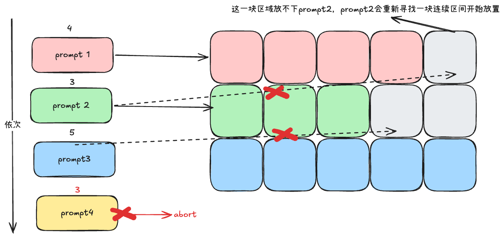

# KV Cache

KV Cache 是 llm serving中相当关键的一部分

需要理解：

什么是kv cache

然后如何管理kv cache

如何可以更少的计算kv cache

# 什么是KV Cache & 瓶颈分析

作答思路: 定义，为什么存在

## KV Cache是什么

定义：KV Cache 是指大模型推理时，把 Transformer 每一层 Attention 中已经计算好的 Key 和 Value 向量缓存下来。

为什么：

大模型计算过程中会计算一个注意力机制，通过输入依次计算query key value 三个矩阵

然而，decode过程是一个自回归过程，每次需要对历史 token 做 Attention。在这个过程中，多次的计算都属于重复。

有了 KV Cache，Prefill 阶段先算好并存入显存，Decode 阶段只计算新 token 的 Q/K/V，并拼接使用缓存，从而把 Decode 的注意力计算从 O(n²) 降到 O(n)，显著提升推理效率。代价是会占用一定显存，实际系统中通常会配合 PagedAttention 或 GQA 来优化。


## KV Cache 显存占用定量分析

这个逻辑很混乱，应该先计算一个token需要耗费多少（一个slot的大小）

b 为batch size，**<u>t 为序列总长度（包括用户提供的提示词（prompt）以及模型生成的补全部分（completion））</u>**，n_layer 为解码器块/注意力层数，n_heads 为每个注意力层的注意力头数，d_head 为注意力层的隐藏维度，p_a 为精度对应比特数目。kv各一个所以需要乘以2。多头注意力（MHA）模型使用 KV 缓存技术，每个 token 的内存消耗量（以字节为单位）为：
$$
kv — cache-memory-bytes = 2 × b × t × n_{layer} × n_{heads} × d_{head}× (p_a / 8)
$$
其中，

| 精度  | p_a  | 用途               |
| ----- | ---- | ------------------ |
| INT 8 | 8    | 权重量化，kv cache |
| INT 4 | 4    | 超低精度量化       |
| FP 8  | 8    | 混合精度训练       |
| FP 16 | 16   | 推理               |
| FP 32 | 32   | 训练高精度推理     |
| BF 16 | 16   | 训练，推理         |
|       |      |                    |

==**kv cache 节约计算量计算模拟**==

```
假设这一次的输入文本长度为n=1000
# 在不使用kv cache的情况下
第一次 计算 key value 1000*2 key一次 vakue一次
。。。。
需要计算1000次  
所需计算量为key value 1000*3

# 在使用kv cache的情况下
第一次计算 需要计算key value 1000*2
之后都是1次
因此
所需计算量1000*2

```

从以上数据可以看出，**KV 缓存内存消耗可能会变得非常大，甚至超过了加载大型序列模型权重所需的内存量。**

#  单机内存管理KV Cache 的管理策略

> [!IMPORTANT]
>
> 目标：解决“存哪里、怎么存、存不下怎么办”的问题。

## 传统显存管理

KV Cache 是指大模型推理时，把 Transformer 每一层 Attention 中已经计算好的 Key 和 Value 向量缓存下来。通常我们会将其放置在gpu的HBM中，但是这里的大小有限。这时候就需要我们更好的利用整体的空间大小

> 模型中不是每一层都是attention操作啊，query，MLP 中间状态，LayerNorm / Activation 状态

最初，HBM分配是seq到来找到一块连续的空闲空间，这会造成大量的内存碎片。



## PagedAttention 详解：操作系统思想在显存管理中的应用

这意味着：

- ✅ 用 **指针 + offset**
- ✅ 假设内存是 **一整块连续 buffer**
- ✅ kernel 内部不做复杂的索引/跳转

👉 一旦变成非连续：

- kernel 要维护 **block index**
- cache 命中模式被打乱
- 性能急剧下降

```python
# kv_cache 申请
kv_cache = malloc(seq_len * layer * head * dim * sizeof(dtype));
# 直接去寻址
for i in (0, seq_len):
    attention(kv_cache[i])
```


## KV Cache 生命周期：分配、追加、释放与抢占（Preemption）

# 减少 KV Cache 显存开销的的优化技术

> [!IMPORTANT]
>
> 目标：这是目前学术界和工业界最卷的方向，也是你大纲的重点。

## 降低单请求存储开销（如何让 Cache 更小）

*目标：通过算法或精度优化，减少单个序列占用的显存空间。*

### 架构层面的压缩

- **GQA / MQA (Grouped/Multi-Query Attention)**： 减少 Key/Value 的头数（Heads），迫使多个 Query 共享同一组 KV，直接成倍缩减 Cache 体积。
- **MLA (Multi-head Latent Attention)**： DeepSeek-V2/V3 核心创新，通过低秩联合压缩 KV，极大降低传输和存储负担。

### 长度压缩

- **滑动窗口注意力 (Sliding Window Attention)**： 限制每个 Token 只能关注局部窗口，丢弃过远的 KV Cache，以牺牲一定全局感知为代价换取线性复杂度。

### 低精度量化

- **KV Cache Quantization (INT8/INT4)**： 将原本 FP16/BF16 的 Cache 量化至更低比特，直接压缩内存占用，但需权衡精度损失。

------

## 提高跨请求复用效率（如何更少地重复计算）

*目标：利用请求间的公共前缀，避免重复计算相同的 Context。*

### 前缀缓存 (Prefix Caching)

- **原理**：在多轮对话或 Agent 场景中，System Prompt 或工具调用描述通常占据大量前缀且固定不变。
- **实现**：通过哈希索引识别相同的前缀 Token，直接复用已计算好的 KV Cache Block，从而跳过 Prefill 阶段的重复计算。

### 多级缓存架构 (Tiered Caching)

- **背景**：单纯靠 GPU 显存（HBM）无法存下所有历史会话的 Cache，且随着 Batch Size 增大容易 OOM。
- **分级策略**：构建 **HBM (GPU) -> DRAM (CPU) -> SSD (磁盘)** 的三级缓存池。 **HBM**：存放当前正在推理的活跃 Cache，追求极致速度。 **DRAM/SSD**：存放冷数据或历史会话的 Cache，作为容量扩展。
- **挑战**：需要处理跨设备的数据迁移（Offloading）延迟，平衡 I/O 速度与存储容量。

### RadixAttention


# 第四部分：KV Cache 的传输与分布式

##  KV 传输机制：Onloading 与 Offloading 的 I/O 瓶颈


## 异步传输与 Overlap：隐藏数据搬运延迟


## 分布式并行策略：TP、PP 与 CP 下的 KV 分布与通信

# 前沿模型案例分析

## DeepSeek-V3（MLA）—— Latent KV Cache Pool

**Pool 里存的不是 K/V，而是低秩 latent + 解耦 RoPE key：**

```
每层每 token缓存:
  c_KV  (latent) : [kv_lora_rank]        → 通常 512
  k_R   (RoPE)   : [qk_rope_head_dim]    → 通常 64
  （不存 V 的 rope，V 从 c_KV 解压）
```

- **元素数/层/token** = `d_c + d_rope = 512 + 64 = 576`（FP16 ≈ **1.15KB**）
- K/V 在计算时通过 `W_UK @ c_KV`、`W_UV @ c_KV`**即时展开**，推理时常把 `W_UK`吸收进 `W_Q`省一次 GEMM
- Pool 是 **1D latent vector per token per layer**，无 `num_heads`维度

📊 对比普通 MHA（同隐藏 dim 7168）：

|                       | MHA/GQA               | DS-V3 MLA          |
| --------------------- | --------------------- | ------------------ |
| 每 token 每层 KV 元素 | 32768                 | **576**            |
| 压缩比                | 1×                    | **~57× 小**        |
| Pool 内容             | `[n_kv_heads, d_h]×2` | `[512]+[64]`latent |

✅ KV Pool 极小，长上下文显存友好

⚠️ 解码时需 up-project latent → 多一次 matmul（可吸收进 W_Q）

------

## DeepSeek-V4（CSA + HCA 混合压缩）—— 多级 KV Pool

DS-V4 在 MLA **latent-per-token** 基础上，再对**序列维度做分段压缩**，因此 Pool 变成**混合型**：

### Pool 组成（示意）

```
┌─ 近期滑动窗口（最近 ~128 token）→ 存完整 MLA latent (576/token)
│
├─ CSA 区（Compressed Sparse Attn）→ 每 ~4 token 合并为一个 compressed KV entry (~128 dim equiv)
│
└─ HCA 区（Heavily Compressed Attn）→ 每 ~128 token 合并为一个 coarse summary KV entry (~4 dim equiv)
```

- **最近窗口**：与普通 MLA 一样，逐 token 存 `(c_KV, k_R)`
- **中段（CSA）**：token 分组 → 轻量压缩，存压缩后的 KV 摘要（比完整 latent 小 ~4×）
- **远端（HCA）**：大段历史 → 极度压缩全局摘要（比完整 latent 小 ~数十倍）

📐 估算（DS-V4 vs DS-V3）：

- DS-V3 每 token/layer ≈ 576 elem
- DS-V4 等效"每 token 分摊"≈ **几十分之一 DS-V3**（公开称 1M ctx 下 KV cache ≈ DS-V3 的 7%~10%）

✅ 支持 1M+ context

⚠️ Pool 管理复杂——需维护三种粒度 block + 压缩状态 + RoPE 修正


# 相关学习资料

https://github.com/ForceInjection/AI-fundamentals/blob/main/09_inference_system/kv_cache/README.md
