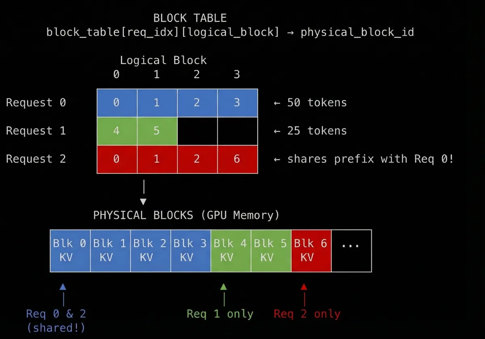
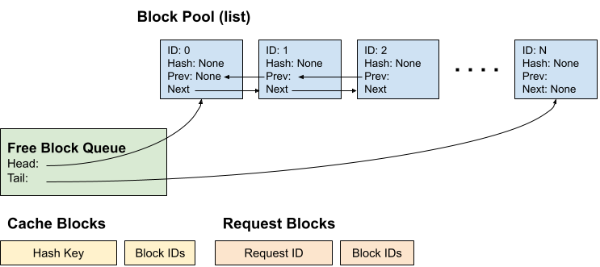

# KV Cache 管理

KV cache 的管理全靠一张block映射表，Block Manager是vllm中关键的一环，因此我们单独来开一张进行讲解

首先，vLLM提前分配了一个固定大小block的pool，所有的这些都在FreeKVCacheBlockQueue#free_block_queue，这些blocks默认是16个tokens大小，

每个block用KVCacheBlock来代表：

```python
class KVCacheBlock:
    # The block ID (immutable)
    block_id: int
    # The block hash (will be assigned when the block is full,
    # and will be reset when the block is evicted).
    block_hash: BlockHash
    # The number of requests using this block now.
    ref_cnt: int

    # The pointers to form a doubly linked list for the free queue.
    prev_free_block: "KVCacheBlock | None" = None
    next_free_block: "KVCacheBlock | None" = None
```

- block_id: 对应的物理GPU memory块
- ref_cnt: 多少个请求使用该块
- block_hash: [prefix caching](https://zhida.zhihu.com/search?content_id=267337482&content_type=Article&match_order=1&q=prefix+caching&zhida_source=entity)前缀缓存的内容hash(具体见下文)

**Request to Blocks请求到块的逻辑映射**

当一个请求到达时，token首先会被映射到logical block逻辑块的位置：

```python
block_index = token_position // block_size # which block
offset = token_position % block_size # position within block
```

我们将一组16个token从逻辑上，映射到一个block块，比如一个50 token长的prompt需要ceil (50/16) 4 个 blocks：

```text
Request: "The capital of France is Paris which is known for..." (50 tokens)

Token positions:  [0-15]    [16-31]    [32-47]    [48-49]
                    ↓          ↓          ↓          ↓
Logical blocks:  Block 0    Block 1    Block 2    Block 3
                 (full)     (full)     (full)     (partial)
```

这时候只是计算好，并没有将block分配到对应的gpu上

vLLM使用block hashing的方法，该思路是基于token ID来计算出content-addressable从内容寻址的block的hash。当一个请求到来时，一个block hash被计算出来，然后用来查询cache，如果hash已经存在，我们就复用缓存的block，如果没有查到，就从free队列中取出一个block，然后分配给它。这些hash也会被存到一个表里用来查询。

```python
def hash_block_tokens(
    parent_block_hash: BlockHash | None,
    curr_block_token_ids: Sequence[int],
    extra_keys: tuple[Any, ...] | None = None,
) -> BlockHash:

    if not parent_block_hash:
        parent_block_hash = NONE_HASH  # seed for first block

    return BlockHash(
        sha256((parent_block_hash, tuple(curr_block_token_ids), extra_keys))
    )
 =======  
hash(block 0) = sha256(NONE_HASH, tokens[0:16], extras)
hash(block 1) = sha256(hash(block 0), tokens[16:32], extras)
hash(block 2) = sha256(hash(block 1), tokens[32:48], extras)
```

notes：对于该位置的hash编码还会同事编码他的上一个，这样的好处有一个没如果block5过来的话发现hash匹配的话，说名前面一个都是等同，相当于完成前面几个block 的前缀匹配

你也可能会想：为什么不单独直接hash每一个block呢？问题是我们用了causal attention因果注意力，token 32的KV 值是取决于token 0 - 31，如果我们要复用block 2的缓存的KV tensor的话，我们也就间接地假设了block 0 和block 1是相等的。单独hash每个token并不能保证这一点，所以需要将parent block hash加进来。



# SingleType KV Cache Manager

根据上述描述，blockmanager主要通过ref_cnt和一个双向链表来实时管理




调度逻辑：

```
Scheduler
  │if request.num_computed_tokens == 0:只需要去读取kv 反之需要额外给出kv block用于计算
  ├─ get_computed_blocks(request)
  │     └─ coordinator.find_longest_cache_hit()
  │           └─ 用 request.block_hashes 在 cached_block_hash_to_block 查找
  │              返回：cached_blocks + num_new_computed_tokens
  │
  └─ allocate_slots(request, ...)
        ├─ 1. 计算还需要多少新块
        ├─ 2. touch(computed_blocks)  ← 把缓存命中的块从 free queue 摘除，防止被 evict
        ├─ 3. block_pool.get_new_blocks(n)  ← 从队头 popleft_n(n)
        │     每块若有 block_hash → _maybe_evict_cached_block()  ← LRU eviction
        └─ 4. cache_full_blocks()  ← 新分配的块若已满，立即写入 cached_block_hash_to_block

```

```python
def find_longest_cache_hit(
    self,
    block_hashes: list[BlockHash],
    max_length: int,
    cached_block_pool: ExternalCachedBlockPool,
    *,
    apply_eagle: bool = True,
) -> tuple[tuple[list[bool], ...], int]:
    """Returns ``(load_mask_per_group, hit_length)``. ``mask[g][i]`` is True iff
    group ``g`` populates chunk ``i`` locally (e.g. SWA and Mamba tail-only);
    recv-side callers skip False slots.

    ``apply_eagle`` controls whether the per-spec ``use_eagle`` last-block
    pop is applied. Lookup callers want it (the drafter requires recomputing
    the last block); per-chunk mask callers must not, because ``token_len``
    already reflects the eagle-pruned hit length and a second pop would
    leave the trailing block unloaded.

    max_length : req.length - 1, 需要recompute 最后一个block 去obtain logits
    """
    blocks_per_group, hit_length = self._find_hit_blocks(
        block_hashes, max_length, cached_block_pool, apply_eagle=apply_eagle
    )
    masks = tuple(
        [blk is not cached_block_pool.null_block for blk in blocks]
        for blocks in blocks_per_group
    )
    return masks, hit_length
```

其中，通过block_pool对于全部kv cache进行动态管理

```python
class BlockPool:
  def __init__(...):
    self.blocks: list[KVCacheBlock] = [
            KVCacheBlock(idx) for idx in range(num_gpu_blocks)
        ] 
    free_block_queue = FreeKVCacheBlockQueue(self.blocks)       ← 所有块先全入队
    self.null_block = self.free_block_queue.popleft()  ← block_id=0 作为哨兵块
    self.null_block.is_null = True

	# 主要为了保护缓存命中cache不被淘汰
  def touch(self, blocks: Sequence[KVCacheBlock]):
      for block in blocks:
      if block.ref_cnt == 0 and not block.is_null:   ← 该模块第一次有人使用的时候，移出free queue
          self.free_block_queue.remove(block) 
      block.ref_cnt += 1 标记有人使用
      if self.metrics_collector:
          self.metrics_collector.on_block_accessed(block)
  
  #kv cache 无人使用，将其释放关键为ref_cnt == 0
  def free_blocks(self, ordered_blocks: Iterable[KVCacheBlock]) -> None:
    blocks_list = list(ordered_blocks)
    for block in blocks_list:
        block.ref_cnt -= 1
    self.free_block_queue.append_n(
        [block for block in blocks_list if block.ref_cnt == 0 and not block.is_null]
    )
    
	#获得目前有多少空缺的block
  def get_new_blocks(self, num_blocks: int) -> list[KVCacheBlock]:
    if num_blocks > self.get_num_free_blocks():
        raise ValueError(f"Cannot get {num_blocks} free blocks from the pool")

    ret: list[KVCacheBlock] = self.free_block_queue.popleft_n(num_blocks) # 从free列表中拿到足够量的块，淘汰那些许久没用的

    # In order to only iterate the list once, we duplicated code a bit
    if self.enable_caching:
        for block in ret:
            self._maybe_evict_cached_block(block) #若blockhash存在，从reset_hash
            assert block.ref_cnt == 0
            block.ref_cnt += 1
            if self.metrics_collector:
                self.metrics_collector.on_block_allocated(block)
    else:
        for block in ret:
            assert block.ref_cnt == 0
            block.ref_cnt += 1
            if self.metrics_collector:
                self.metrics_collector.on_block_allocated(block)
    return ret
```

> 相较于v0，v1的block是append_only模式，也就是两个seq，可能持有内容完全相同的不同物理块，

# Hybrid KV Cache Manager

假设场景：

模型：1 个 Full Attention 层 + 1 个 SWA 层（sliding_window=32）
 block_size = 16，请求长度 = 100 tokens

------

如果只用一套 block table（不做 Hybrid），最直觉的做法：所有层共享同一个 block table。


```
Token: [0..15] [16..31] [32..47] [48..63] [64..79] [80..95] [96..99]
Block:    #0      #1       #2       #3       #4       #5      #6(partial)
```

Full Attention 层：✅ 正确，需要访问所有 100 个 token 的 KV，用 block #0~#6 完全合理。

SWA 层：❌ 问题来了——

SWA 在计算 token #99 的 attention 时，窗口是 [#68..#99]，**只需要读最近 32 个 token 的 KV**，blocks #4~#6 就够了。但共享 block table 意味着：

1. SWA 层仍然要把 token #0~#67 的 KV **写进** block #0~#3（白白占用显存）
2. block #0~#3 永远不会被 SWA 读，但**不能释放**（FA 层还在用）
3. 整个请求存活期间，block #0~#3 被"锁死"在内存里

本质希望通过同一个pool服务所有layers types。The memory pool is split into multiple blocks with the **same page size.**


整体创建不同的KV Cache的过程

```
Scheduler
    │
    ▼
KVCacheManager              ← 对 Scheduler 的唯一接口
    │
    ▼
KVCacheCoordinator          ← 协调多个 group（抽象基类）
    ├── KVCacheCoordinatorNoPrefixCache   (前缀缓存关闭)
    ├── UnitaryKVCacheCoordinator         (单 group 模型，如纯 FA)
    └── HybridKVCacheCoordinator          (多 group，如 FA + SWA)
            │
            ▼
    SingleTypeKVCacheManager × N    ← 每个 group 一个，各自管自己的 req_to_blocks
        ├── FullAttentionManager
        ├── SlidingWindowManager
        ├── ChunkedLocalAttentionManager
        └── MambaManager
            │
            ▼
    BlockPool                        ← 所有 group 共享同一个物理块池
```


引入 **KV Cache Group** 的概念，把需求相同的层分为一组，共享相同的 block 分配结果：

```python
self.single_type_managers = tuple(
    get_manager_for_kv_cache_spec(
        kv_cache_spec=kv_cache_group.kv_cache_spec,
        max_num_batched_tokens=max_num_batched_tokens,
        max_model_len=max_model_len,
        block_pool=self.block_pool,
        enable_caching=enable_caching,
        kv_cache_group_id=i,
        dcp_world_size=dcp_world_size,
        pcp_world_size=pcp_world_size,
    )
    for i, kv_cache_group in enumerate(self.kv_cache_config.kv_cache_groups)
)
```

有哪些kv cache

## vllm v4  kv cache 管理

相较于之前增加了

### KV cache布局

vllm v4的kv cache 类型

| 层类型           | compress ratio | 逻辑block_size | storage Block_size |      | 每token字节数 | real page_size(B) | 对齐后page_size |      | 层数 | pad后page_size |
| ---------------- | -------------- | -------------- | ------------------ | ---- | ------------- | ----------------- | --------------- | ---- | ---- | -------------- |
| C4A 主kv         | 4              | 256            | 64                 |      | 584           | 37376             | 37440           |      | 21   | 37440          |
| C128A 主kv       | 128            | 256            | 2                  |      | 584           | 1168              | 1168            |      | 20   | 1728           |
| C4A 索引器kv     | 4              | 256            | 64                 |      | 132（unit8）  | 8448              | 8640            |      | 21   | 8640           |
| swa 缓存         | 1              | 64             | 64                 |      | 584           | 37376             | 37440           |      | 41   | 37440          |
| C4A 压缩器       | 1              | 4              | 4                  |      | 8192（fp32）  | 32768             | 32832           |      | 21   | 37440          |
| C128A 压缩器状态 | 1              | 8              | 8                  |      | 4092（fp32）  | 32768             | 32832           |      | 20   | 37440          |


vllm根据不同的page_size 申请不同的tensor，每个tensor的block数量一致

## block table布局

vllm根据block_size 划分为三个group，对应不同的single_type_kv_cache_manager. 其中swa被拆分两个group 所

Group1： C4A,C128A,C4A index -> block_table1

Group2： SWA1 -> block_table2

Group3： SWA2 -> block_table3

Group4： C4A state -> block_table4

Group5： C128A state-> block_table5

# KV Transfer

现在部署形态越来越多是pd分离形态，所以kv 传输也是十分重要
