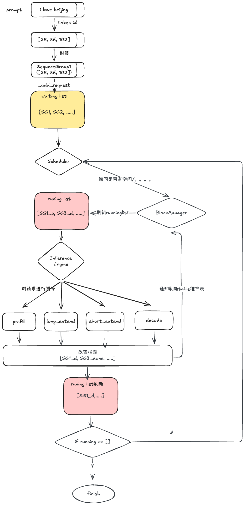

# VLLM

VLLM 是一个开源的推理框架，其核心目标是在有限的显存条件下，显著提升模型的**吞吐量**与**显存利用效率**。他主要针对解决的是解码阶段的内存瓶颈。在解码阶段，每轮推理都需要加载完整的模型权重与 KV Cache。其中，**KV Cache 的大小和调度策略**是影响推理速度的关键因素。

针对上述问题，vllm也提出了自己的解决方案

- [PageAttention](# PageAttention)
- [KV Cache 管理](# KV Cache 管理)


## PageAttention

### 概念

正如前文所述，传统 KV Cache 需要以连续方式存储，通常在解码阶段必须提前预留整块内存，这种做法极易产生大量**内存碎片**。PageAttention 借鉴操作系统的<u>**虚拟内存分页机制**</u>，首先将 KV Cache 划分为固定大小的块，将其存储在不连续的物理显存空间中，并通过统一的页表机制实现逻辑到物理地址的灵活映射，从而高效复用显存碎片，显著提升显存利用率。经实验验证，该方法能将内存浪费降至 4% 以下。此外，PagedAttention 内核能实现高效地识别、调度与获取这些存储块。

> block大小通常是固定，通常为256token（VLLM）TensorRT-LLM(512 token)
>
> block_size即不能过大也不能过小，过小增加管理开销成本，过大无法充分利用碎片内存（内存碎片 vs 内存浪费）
>
> 
>
> block占用内存计算：
>
> $$block = token * key * 2 * （p_a/8)$$
>
> 


### 详细过程

逻辑块（logical）：将一个请求生成的kv cache看成连续的盒子

物理空间：gpu显存中划分不同大小的区域，用于存储kv cache

块表：维护一张表格，可以按需索取

page attention 实现方法

1. 分块（partitioning）：prompt进来，划分为**<u>固定大小的块</u>**，比如一共有7个token，每四个token一个block，则token0-3为 block1，剩余3个和一个空置位置为block2
2. 动态获取存储空间（dynamic allocate）：在decoding过程中，当前block满了，才会去新申请一个块出来，这个块可以是不连续的
3. 高效索取（kenel execution）：新写一个kernel，gpu线程根据块表，去拿到想对应的block


**优势：**🤔 为什么能达到高吞吐

- 超高吞吐量：在相同硬件下，其吞吐量通常比Hugging face transformer高处24倍，比TGI（text generation infernece）高处3, 5倍

- 极高显存利用率，消除内存碎片，vllm可以在同一块gpu上处理更多的请求（batchsize更大）

- 低延迟，通过continuous batching技术，新请求不需要等待旧请求全部结束，而是可以立即加入，显著降低用户等待时间

- 适用场景；

- 高并发api、成本优化、私有化部署、长文本生成：处理超长上下文表现更加稳健


## vllm运行流程

- 请求接入与分发：a. 接到用户的prompt，首先转化为一组tokenid b. 将用户的请求进行封装sequence group c. 请求首先全部进入waiting list 进行等待

- ❗️调度与连续批处理 🤔

  调度指的是为了可以更好的使用到全部的显存，他不需要跟之前一样需要等到该batch内的全部请求完成再进行释放，而是该batch内seq a 完成即释放该部分内存，并从waiting list中拿出一个新的seq放入running 序列中

- 显存管理 block manager

  首先他需要完成逻辑block - 》 物理block的映射

  其次他是动态按需分配： 无需为没个请求预留过多空间，进行waiting — running的不停转换

- 推理过程 prefill & decode

  prefill 并行完成prompt的全部kv cache计算再全部传送给decode🤔

- 输出处理和请求结束

  a. 采样sampling 根据输出概率预测下一个token（greedy、top-p、top-k）

  b. 流式返回streaming 生成token立即返回，减少用户的等待时间

  c. 释放资源：一旦请求遇到**<u>停止符</u>**或者**<u>达到最大长度</u>**，调度器会将其移出队列，并将他空余出来的显存标记为空闲，进行释放




# KV Cache 管理


详细内容查看：[KV Cache管理](./KV Cache管理.md)


## 初始化 

之前v0版本


v1版本

整体框架


初始化大致流程


# PD分离

==pd分离方法 -- 》中心和分布==


中心式更受欢迎，离散式的优势是架构清晰，性能更好，但扩展性、链路稳定性都不理想。

配合大模型进行传输需要注意

当加载模型过大时一般需要用到模型并行（TP、PP、EP、SP等）。而这会使得模型计算的KV值分散在各个rank设备中（GPU/NPU），而P模型和D模型的分布式策略可能还不一样，比如P实例用TP4、EP1，D实例用TP1、PP2、EP4，这样P和D实例无法直接进行一对一的rank传递。 因此需要数据先聚合再传递


## 基本知识

prefill 与 decode阶段

- prefill阶段，涉及模型初始prompt的处理，生成初始的hidden states。 涉及一次forward
- decode阶段，根据hidden states逐步升昌后续的文本，计算相对较少，只计算最新token激活值

> 对于一个请求来说，一次prefill 然后多次decode，（单次prefill时间长，总长短）/（单次decode 短，但是总长长）/decode是一个串行

p d 分离的优势：

- 资源利用优化
- 提高吞吐量：prefill 和 decode可以同时处理不同的请求，这意味着prefill阶段处理新请求的同时，decode可以处理之前请求的解码任务
- 降低延迟：由于prefill 和decode分别在不同阶段进行，可以减少等待时间，特别是当多个请求并发到达时候

p d 分离劣势：

pd 分离需要对kv cache进行传输，prefill侧算出来的cache需要传送到decode上，时延被计算和访存掩盖

掩盖的核心思想：

假设有L层transformer， 当第0层kv cache 算出来之后就可以传输了，当decode在需要解析第一个token的时候已经拿到第零层，则传输时延就被完美隐藏

第i层kv cache 什么意思？


所以我需要计算最新的O_i，只需要知道这一层的东西就行


#### **Prefill阶段的优化策略**

针对Prefill阶段的特点，以下优化策略能有效提高其效率，充分利用GPU的并行计算能力，减少计算冗余，并最终降低首个token生成时间（TTFT）。

1. **批量处理技术**：批量处理（Batching）是一种常见的优化方法，通过将多个用户的推理请求组合成一个批次进行处理，从而提高GPU的利用率和吞吐量。

   v1.0 **静态批量处理（Static Batching）**：将同时到达的所有推理请求组成一个批次，然后一次性进行预填充计算。这种方法能有效利用GPU的并行计算资源，提高整体吞吐量，但可能导致处理时间短的请求需等待批次中最慢的请求完成，增加延迟。

   v2.0 **连续批量处理（Continuous Batching）**：也称为动态批量处理或飞行中批量处理，在推理的迭代层面进行批次管理。<u>**当批次中某个请求完成后，可以立即用新请求替换它，无需等待整个批次完成。**</u>这种方法更有效地利用GPU资源，减少空闲时间，并可能降低平均延迟。

   v3.0 chunked prefill：他是为了解决传统服务中非prefill 即 decode，而且prefill优先级是高于decode的，所以会造成大量请求等待的现象。chunked prefill让prefill和decode能同时放在一个batch里做推理。

- 

> 假设最开始有A、B两个序列，他们都处在decode阶段。在A和B完成1次decode之后，来了C和D的两个请求。由于vllm是prefill优先的，所以它会先处理C和D的prefill，这就使得decode暂停了。等C和D的prefill完成了，A、B、C、D再同时做decode。
> 可以看到，这种情况下，A和B的第1次decode的第2次decode间隔的时间变长了，导致了A和B用户的等待。

​		chunked prefill 实现方法：

		1. 先将所有req切分成一样的chunk大小，c和d切分不了那么大，所以他中间存在空隙去安放别人的decode
		1. 其次这些 chunks 间的气泡可以插入/捎带（piggyback）其他完成了 prefill 的 prompts 的 decode 需求。


对于比较长的请求序列，它的prefill无法再一个batch里执行完，它会做[chunk](https://so.csdn.net/so/search?q=chunk&spm=1001.2101.3001.7020)切割，分在多个batch里完成。所以叫做chunked-prefill。

**最大化解码批量处理（Decode-Maximal Batching）**：将一个预填充请求分割成等大小的块，然后将一个预填	充块与多个解码请求组合成一个批次处理。这种方法允许从单个预填充请求创建多个批次，优化解码请求的处理，但可能增加解码延迟。

2. **[张量并行](https://zhida.zhihu.com/search?content_id=255117291&content_type=Article&match_order=1&q=张量并行&zhida_source=entity)**

   张量并行（Tensor Parallelism）适用于超大型LLM，将模型的计算负载分布到多个GPU上。通过将模型的各层（如[Transformer层](https://zhida.zhihu.com/search?content_id=255117291&content_type=Article&match_order=1&q=Transformer层&zhida_source=entity)中的自注意力模块和多层感知机）分割成更小的计算块，这些块可在不同GPU上并行执行。

3. prefill 共同前缀

   当同一个 batch 内的多个 Prompt 存在**共同前缀**（如固定指令、场景描述、格式要求）时，Prefill 阶段（Transformer 模型生成第一个 token 前的编码计算）可通过 “共享前缀计算结果” 减少重复运算 —— 模型只需对共同前缀编码一次，再对每个 Prompt 的独有后缀单独编码，最终合并结果，大幅降低计算量和 latency。

   ```
   LCP：longest common prefix
   class Solution:
       def longestCommonPrefix(self, strs: List[str]) -> str:
           if not strs:
               return ""
    
           prefix, count = strs[0], len(strs)
           for i in range(1, count):
               prefix = self.lcp(prefix, strs[i])
               if not prefix:
                   break
    
           return prefix
    
       def lcp(self, str1, str2):
           length, index = min(len(str1), len(str2)), 0
           while index < length and str1[index] == str2[index]:
               index += 1
           return str1[:index]
   ```


#### **Decode阶段的优化策略**

Decode阶段由于其串行性及对内存带宽的高度依赖，需采用不同的优化策略来提高效率，主要目标是减少内存访问延迟，避免计算冗余，并降低每输出token的时间（TPOT）和整体延迟。


## FAQ

1. PD分离部署，p和d所占用的卡数目是一样的 4P 1D  （12个节点）；相

   当于p在8个节点，D在4个节点上？？？

   一个节点时1P1D 

2. PD分离适用场景：

   必须有较强的SLO约束（TTFT< 1~3s, TBT<50~80ms）

   长输入多输出（输入> 3* 输出）

   并发量需要多机

3. PD分离的主要收益阶段是decode阶段

4. decode需要组大batch：LLM的decode过程中，耗时最大的是MatMul和FlashAttention，FA是带宽密集型，有数据搬运的计算平静，数据拌匀分为权重（weight）和 KVCache（KV）搬运，Batchsize = 1时，搬运量为weight * 1 +KV * 1；Batchsize = N时，weight * 1 +KV * N；

5. P如何找到一个D ： 根据负载信息，发当前的KVcache大小和调节节点，进行评估

6. PD比例：

   

   

   


# 多p多d

prefill 和 decode 容易出现两侧资源不均

多p多d 从 4p1d进行扩展

1p两个节点，1d四个节点（为什么如此设计）

## prefill的调度策略：

1. 先根据TTFT判断prefill是否处与亚健康状态

   ›TTFT：Time To First Token 首token时延

2. 选择哪一个p：根据prompt内容进行匹配，优先选择处理过相似请求的prifill，可以使用tensor cache

3. prefill 分为长请求，短请求以及混合三种类型

4. 额外 随机调度

## Decode的调度策略

1. 高吞吐低时延：格局请求类型选择高吞吐和低时延
2. KV cache，根据decode TE空闲KV cache 数量进行调度，优先选择 KV cache 剩余数量最多的Decode
3. PD亲和调度：当模型实例部署跨超节点时，优先选择节点内PD处理请求


## 极致弹性

多p多d扩缩容功能根据SLA满足读衡量是否出发扩缩容

优化方向：

进程启动，模型加载，decode算子编译三个方面

1. warmup pool

2. 模型权重加载

Deepv3 模型为例，模型大小约为671G，

deepseek r1 模型，模型大小约为480G

以两节点prefill 部署deepseek v3量化模型为例，从本地盘加载，爬格子cache加载，以及NPU-fork加载耗时测试结果如下：

| 模型大小 | 读本地盘 | 读pagecache | NPU fork |
| -------- | -------- | ----------- | -------- |
| 671G     | 920s     | 96s         | 6s       |

==为什么decode侧加载很慢？==

一些数据的一算：

假设4p 1d规格，每一个p都需要加载这么多模型大小，然后一个p有两个节点，一个节点加载671/2 = 335G 带宽： 335*1024 M/920s = 372M/s

3. compile cache 

decode 侧**首次**forward流程会触发算子编译构图，整个编译过程长达20分钟


# PD分离下，kv cache传输

https://github.com/ForceInjection/AI-fundamentals/blob/main/09_inference_system/kv_cache/README.md

### NCCL/RCCL

主要应用于集合通信场景，如LLM训练和推理中的allreduce操作。NCCL和RCCL的设计和代码库几乎相同，区别仅在于分别针对Nvidia和AMD GPU优化。它们提供灵活的send/recv点对点传输API，可用于KV cache传输。但即使在执行send/recv点对点传输时，NCCL/RCCL也需要启动GPU内核，因此会消耗部分GPU SM资源。这些SM资源主要用于复杂集合操作中的数据拷贝和规约运算，在纯P2P传输场景中本可避免。

### NIXL

由Nvidia Dynamo分布式LLM推理框架开发，是其KV传输解决方案。采用模块化设计，支持多种传输后端，包括文件系统、POSIX socket和RDMA网络。其RDMA网络后端有两种实现：一种是基于HPC领域知名通信库 [UCX](https://link.zhihu.com/?target=https%3A//github.com/openucx/ucx)；另一种正是我们将要测试的Mooncake TE。值得注意的是，UCX支持AMD GPU。NIXL提供与NCCL/RCCL完全不同的API，采用KV cache导出节点与导入节点之间的read/write操作模式。节点需要通过带外网络（如TCP socket或ETCD endpoint）导出其KV cache的元数据，以便其他节点能够读写KV数据。由于采用[GPU-Direct RDMA](https://zhida.zhihu.com/search?content_id=261732690&content_type=Article&match_order=1&q=GPU-Direct+RDMA&zhida_source=entity)直接传输KV cache，它不会消耗GPU SM资源。

### Mooncake TE

是Moonshot AI公司Kimi服务平台的一个组件。其API同样不同于NCCL/RCCL，更接近NIXL的read/write风格。它利用GPU-Direct RDMA直接传输KV cache，不占用GPU SM资源。其特色功能是能够自动从PCIe拓扑中检测NIC与GPU的亲和性，因此应用无需指定每个GPU使用哪个NIC。但根据我们的测试，目前它尚未支持AMD GPU。

### UCCL P2P

是我们最新开发的KV cache传输引擎，具有三大特点：零SM占用、轻量级代码库和易用接口。基于UCCL的多路径RDMA传输引擎实现，同时提供read/write和集合式send/recv API，且不占用GPU SM资源，还能自动检测GPU-NIC拓扑关系。其集合API避免了显式带外网络传输元数据的需要。您可以在 [这里](https://link.zhihu.com/?target=https%3A//github.com/uccl-project/uccl/blob/bde34635dfeef86faa43b4bc3ccfcbc92a20aeaf/p2p/collective.py%23L473-L491) 查看我们的集合API实现。

# 其余

**[缓存命中](https://zhida.zhihu.com/search?content_id=253512521&content_type=Article&match_order=1&q=缓存命中&zhida_source=entity)（Cache Hit）**：当处理器或应用程序请求的数据已存在于缓存中时，称为缓存命中。此时，系统可以直接从缓存中获取数据，避免了访问主存储器或其他较慢存储设备的延迟，从而提高了数据访问速度和系统性能。

**[缓存未命中](https://zhida.zhihu.com/search?content_id=253512521&content_type=Article&match_order=1&q=缓存未命中&zhida_source=entity)（Cache Miss）**：当请求的数据不在缓存中时，称为缓存未命中。此时，系统需要从主存储器或其他较慢的存储设备中读取数据，并将其加载到缓存中，以备后续使用。缓存未命中会导致更高的延迟，影响系统性能。

[缓存命中率](https://zhida.zhihu.com/search?content_id=253512521&content_type=Article&match_order=1&q=缓存命中率&zhida_source=entity)是衡量缓存有效性的指标，表示从缓存中成功获取数据的请求占总请求的比例。高缓存命中率通常意味着系统性能较好。

https://blog.csdn.net/21cnbao/article/details/80458173

缓存命中和pagecache命中

### 二、关键区别对比（表格更清晰）

| 维度           | 缓存命中（Cache Hit）                                        | PageCache 命中（PageCache Hit）                              |
| -------------- | ------------------------------------------------------------ | ------------------------------------------------------------ |
| **概念范围**   | 广义，覆盖全系统所有缓存层级                                 | 狭义，仅针对操作系统内核的 PageCache（磁盘缓存）             |
| **所属层级**   | 可在 CPU 缓存、应用缓存、内核缓存、磁盘缓存等任一层级        | 仅在内核层（操作系统与磁盘之间的缓存）                       |
| **缓存对象**   | 可是指令、数据、文件、数据库记录、API 响应等                 | 仅是磁盘文件的 “数据页”（4KB/8KB 等固定大小）                |
| **使用主体**   | CPU、应用程序、操作系统、磁盘控制器等                        | 操作系统内核（为应用程序提供磁盘 I/O 加速）                  |
| **典型场景**   | 1. CPU 从 L2 缓存取指令；2. 应用从 Redis 取用户数据；3. 浏览器从本地缓存取图片；4. 内核从 PageCache 读文件 | 1. 应用读取已缓存的日志文件；2. Nginx 读取静态资源（如 HTML/CSS）；3. 数据库读取磁盘数据后再次访问 |
| **未命中代价** | 取决于下一层存储：CPU 缓存未命中→访问内存（几十 ns）；应用缓存未命中→访问数据库（几十 ms） | 未命中→发起磁盘 I/O（几 ms~ 几十 ms），延迟远高于内存访问    |
