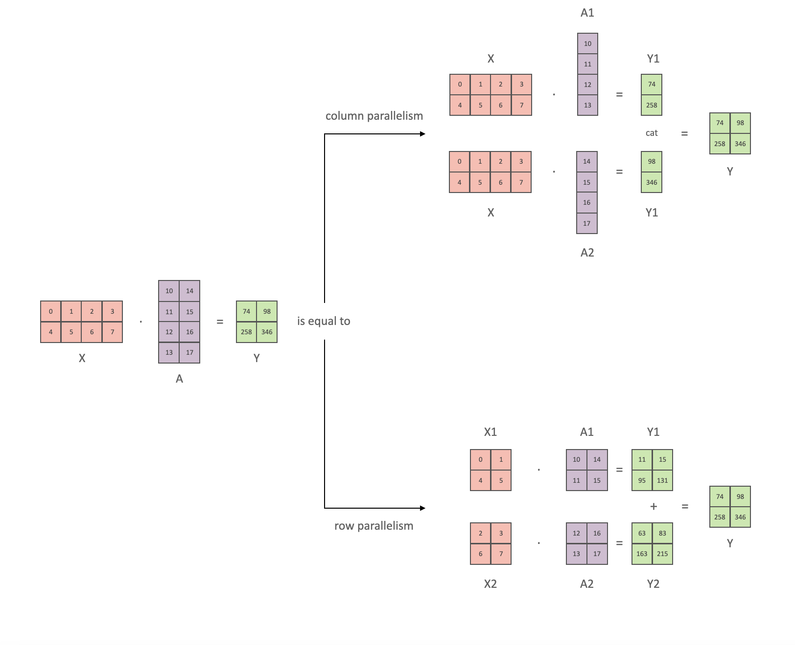
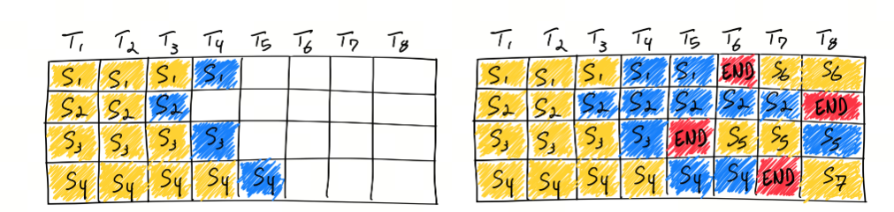
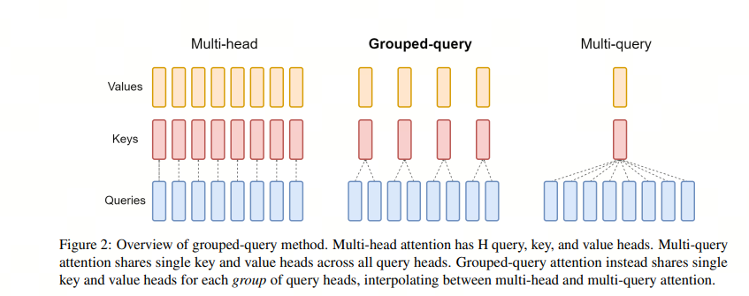

# 推理架构

除了分布式推理和支持量化之外，大模型推理框架最大的用处是加速推理。加速推理的主要目的是==提高推理效率，减少计算和内存需求，满足实时性要求，降低部署成本：==

**计算和内存**：大模型通常需要大量的计算资源和内存来处理复杂的任务。这在资源受限的场景中，如移动设备或边缘计算环境中，会造成推理效率低下的问题。为了解决这一问题，需要通过优化技术提高推理效率，减少计算和内存需求；

**实时性**：在许多应用场景中，如语音助手、实时翻译等，用户期望能够获得即时的反馈。大模型的推理速度直接影响到用户体验。因此，加速推理可以减少延迟，提供更流畅的交互体验；

**部署成本**：大模型的部署需要昂贵的硬件支持，如高性能GPU。通过推理加速，可以在较低成本的硬件上部署大模型，降低部署成本，使得大模型的应用更加广泛；

**系统性能优化**：在实际部署中，==大模型的推理性能受到系统层面因素的影响，如**内存带宽**、**计算单元的利用率**等。==通过系统级别的优化，可以提高大模型的推理速度和效率。

> 内存带宽
>
> 计算单元的利用率

许多公司都尝试解决这一类问题，

1. `vLLM`[1](https://github.com/jeopardize/LLMForEverybody/blob/main/02-第二章-部署与推理/大模型推理框架（一）综述.md#refer-anchor-1)是一种基于PagedAttention的推理框架，通过分页处理注意力计算，实现了高效、快速和廉价的LLM服务。vLLM在推理过程中，将注意力计算分为多个页面，每个页面只计算一部分的注意力分布，从而减少了计算量和内存需求，提高了推理效率；
2. `Text Generation Inference（TGI）`[2](https://github.com/jeopardize/LLMForEverybody/blob/main/02-第二章-部署与推理/大模型推理框架（一）综述.md#refer-anchor-2)是一个由Hugging Face开发的用于部署和提供大型语言模型（LLMs）的框架。它是一个生产级别的工具包，专门设计用于在本地机器上以服务的形式运行大型语言模型。TGI使用Rust和Python编写，提供了一个端点来调用模型，使得文本生成任务更加高效和灵活；
3. `TensorRT-LLM` [3](https://github.com/jeopardize/LLMForEverybody/blob/main/02-第二章-部署与推理/大模型推理框架（一）综述.md#refer-anchor-3)是 NVIDIA 提供的一个用于优化大型语言模型（LLMs）在 NVIDIA GPU 上的推理性能的开源库。它通过一系列先进的优化技术，如量化、内核融合、动态批处理和多 GPU 支持，显著提高了 LLMs 的推理速度，与传统的基于 CPU 的方法相比，推理速度可提高多达 8 倍；
4. `Ollama`[4](https://github.com/jeopardize/LLMForEverybody/blob/main/02-第二章-部署与推理/大模型推理框架（一）综述.md#refer-anchor-4)是一个开源框架，旨在简化在本地环境中部署和运行大型语言模型（LLM）的过程。它通过将模型权重、配置和数据集打包成一个名为Modelfile的统一包来实现这一点，使得下载、安装和使用LLM变得更加方便，即使对于没有广泛技术知识的用户也是如此；
5. `DeepSpeed`[5](https://github.com/jeopardize/LLMForEverybody/blob/main/02-第二章-部署与推理/大模型推理框架（一）综述.md#refer-anchor-5)是微软推出的一个深度学习优化库，它不仅支持大规模模型的训练，还提供了推理加速的能力。DeepSpeed-Inference 是 DeepSpeed 的一部分，专注于提高大模型推理的性能，包括延迟和吞吐量.
6. SGlang

# VLLM

详细介绍见[VLLM综述.md](../VLLM详解/VLLM综述.md)

# SGlang

# Text Generation Inference（TGI）

`Text Generation Inference（TGI）`[1](https://github.com/jeopardize/LLMForEverybody/blob/main/02-第二章-部署与推理/大模型推理框架（三）Text generation inference (TGI).md#refer-anchor-1)是一个由Hugging Face开发的用于部署和提供大型语言模型（LLMs）的框架。它是一个生产级别的工具包，==专门设计用于在本地机器上以服务的形式运行大型语言模型==。**TGI使用Rust和Python编写，**提供了一个端点来调用模型，使得文本生成任务更加高效和灵活.

### 1. 加速推理技术

1. Tensor Parallelism

张量并行使用了矩阵乘法可以并行计算的特性，将模型的参数划分为多个部分，每个部分在不同的设备上进行计算，最后将结果进行汇总。下面，我们分别看FFN和Self-Attention的张量并行实现。

`MLP`的主要构建块都是完全连接的 nn.Linear，后跟非线性激活 GeLU。

按照 Megatron的论文符号，我们可以将其点积部分写为 Y = GeLU(XA)，其中 X 和 Y 是输入和输出向量，A 是权重矩阵。

如果我们以矩阵形式查看计算，很容易看出矩阵乘法如何在多个 GPU 之间拆分：

因此，

[Y_1,Y_2] = [Gelu(X\dotA_1,X\dotA_2)]

在传统的批处理方法中，一批请求必须全部完成处理后才能一起返回结果。这就意味着较短请求需要等待较长请求处理完成，导致了GPU资源的浪费和推理延迟的增加。==而Continuous Batching技术允许模型在处理完当前迭代后，如果有请求已经处理完成，则可以立即返回该请求的结果，而不需要等待整个批次的请求都处理完成，这样可以显著提高硬件资源的利用率并减少空闲时间。==

值得注意的是，实现Continuous Batching需要考虑一些关键问题，如对Early-finished Requests、Late-joining Requests的处理，以及如何处理不同长度的请求Batching。OCRA提出的两个设计思路：Iteration-level Batching和Selective Batching，就是为了解决这些问题。

3. Flash Attention

Flash Attention 是一种新型的注意力机制算法，由斯坦福大学和纽约州立大学布法罗分校的科研团队共同开发，旨在解决传统 Transformer 模型在处理长序列数据时面临的时间和内存复杂度高的问题。该算法的核心思想是减少 GPU 高带宽内存（HBM）和 GPU 片上 SRAM 之间的内存读写次数，通过分块计算（tiling）和重计算（recomputation）技术，显著降低了对 HBM 的访问频率，从而提升了运行速度并减少了内存使用。

4. PagedAttention

vLLM引入了 PagedAttention，这是一种注意力算法，其灵感来自操作系统中虚拟内存和分页的经典思想。与传统的注意力算法不同，PagedAttention 允许在非连续的内存空间中存储连续的键和值。具体来说，PagedAttention 将每个序列的 KV 缓存划分为块，每个块包含固定数量 token 的键和值。在注意力计算过程中，PagedAttention 内核会高效地识别和获取这些块。

### 2. TGI的特性

1. **简单的启动器**：TGI提供了一个简单的启动器，可以轻松服务最流行的LLMs。
2. **生产就绪**：TGI集成了分布式追踪（使用Open Telemetry）和Prometheus指标，满足生产环境的需求。
3. **张量并行**：通过在多个GPU上进行张量并行计算，TGI能够显著加快推理速度。
4. **令牌流式传输**：使用服务器发送事件（SSE）实现令牌的流式传输。

> SSE:

1. **连续批处理**：对传入请求进行连续批处理，提高总体吞吐量。
2. **优化的推理代码**：针对最流行的架构，TGI使用Flash Attention和Paged Attention等技术优化了Transformers代码。
3. **多种量化支持**：支持bitsandbytes、GPT-Q、EETQ、AWQ、Marlin和fp8等多种量化方法。
4. **安全加载权重**：使用Safetensors进行权重加载，提高安全性。

> Safetensors:

5. **水印技术**：集成了"A Watermark for Large Language Models"的水印技术。

> 

6. **灵活的生成控制**：支持logits warper（温度缩放、top-p、top-k、重复惩罚等）、停止序列和对数概率输出。
7. **推测生成**：实现了约2倍的延迟优化。
8. **引导/JSON输出**：支持指定输出格式，加速推理并确保输出符合特定规范。
9. **自定义提示生成**：通过提供自定义提示来指导模型的输出，从而轻松生成文本。
10. **微调支持**：利用微调模型执行特定任务，以实现更高的精度和性能。
11. 硬件支持**：除了NVIDIA GPU，TGI还支持AMD GPU、Intel GPU、Inferentia、Gaudi和Google TPU等多种硬件。

# TensorRT-LLM

`TensorRT-LLM` [1](https://github.com/jeopardize/LLMForEverybody/blob/main/02-第二章-部署与推理/大模型推理框架（四）TensorRT-LLM.md#refer-anchor-1)是 NVIDIA 提供的一个用于优化大型语言模型（LLMs）在 NVIDIA GPU 上的推理性能的开源库。它通过一系列先进的优化技术，如量化、内核融合、动态批处理和多 GPU 支持，显著提高了 LLMs 的推理速度，与传统的基于 CPU 的方法相比，推理速度可提高多达 8 倍；

### 1. 加速推理技术

1. Quantization

量化技术是LLM领域中用于优化模型的一种方法，特别是在模型部署到资源受限的环境（如移动设备、嵌入式系统或需要低延迟的服务器）时。==量化的基本思想是将模型中的权重和激活值从浮点数（如32位浮点数，FP32）转换为低精度的表示，==比如8位整数（INT8）或更低位的格式.

2. Continuous batching
3. kv attention

decoder架构里面最主要的就是 transformer 中的 self-attention 结构的堆叠，KV-cache的实质是用之前计算过的 key-value 以及当前的 query 来生成下一个 token。

prefill指的是生成第一个token的时候，kv是没有任何缓存的，需要预填充prompt对应的KV矩阵做缓存，所以第一个token生成的最慢，而从第二个token开始，都会快速获取缓存，并将前一个token的kv也缓存。

可以看到，这是一个空间换时间的方案，缓存会不断变大，所以在私有化部署计算显存的时候，除了模型大小，还要要看你的应用中prompt和completion的大小（当然还有batch-size）。

而增加了空间后，显存又是一个问题，于是人们尝试在attention机制里面共享keys和values来减少KV cache的内容。

这就有了`Multi-Query Attention(MQA)`，即query的数量还是多个，而keys和values只有一个，所有的query共享一组。这样KV Cache就变小了。

但MQA的缺点就是损失了精度，所以研究人员又想了一个折中方案：不是所有的query共享一组KV，而是一个group的guery共享一组KV，这样既降低了KV cache，又能满足精度。这就有了`Group-Query Attention(GQA)`。

> MQA为何会损失精度

4. Graph Rewriting

Graph Rewriting 是 TensorRT-LLM 中用于优化神经网络模型的一种技术。在深度学习模型部署到硬件之前，通常会经过一个图优化的过程，这个过程被称为图重写。TensorRT-LLM 使用声明式方法来定义神经网络，这意味着模型是通过描述其结构和操作的方式来构建的，而不是通过编程的方式逐步构建。

通过图重写，TensorRT-LLM 能够为特定的硬件平台生成优化的执行图，从而在 NVIDIA GPU 上实现高效的推理性能。这种优化可以显著提高模型的运行速度，减少延迟，并提高整体的吞吐量，特别是在处理大型语言模型时尤为重要。

