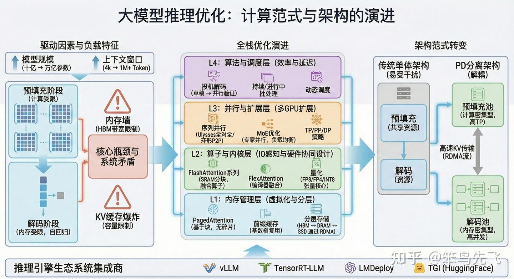

# 面试题目整理

# 参考博客

https://github.com/luhengshiwo/LLMForEverybody/blob/main/02-%E7%AC%AC%E4%BA%8C%E7%AB%A0-%E9%83%A8%E7%BD%B2%E4%B8%8E%E6%8E%A8%E7%90%86/%E5%A4%A7%E6%A8%A1%E5%9E%8B%E6%8E%A8%E7%90%86%E6%A1%86%E6%9E%B6%EF%BC%88%E4%BA%8C%EF%BC%89vLLM.md

# 背景

https://zhuanlan.zhihu.com/p/1994736297252766225

我理解的“推理”，就是模型根据我的输入（问题），一步步计算出输出（回答）的过程。模型参数规模从数十亿（Billion）级别迅速攀升至万亿（Trillion）级别，[上下文窗口](https://zhida.zhihu.com/search?content_id=268995064&content_type=Article&match_order=1&q=上下文窗口&zhida_source=entity)（Context Window）也从早期的4k扩展至1M甚至更高。而这也引发难度从早起的算力不足转移到显存带宽和显存容量。

## 推理瓶颈

犹如我们所认知的那样，LLM的推理过程本质上是非对称的，包含两个截然不同的阶段：预填充（Prefill）阶段和解码（Decode）阶段。这种非对称性是当前所有推理优化技术起点的根源。

- prefill(预填充阶段)他是将人输入的所有prompt先生成一个QKV矩阵，并生成对应的kv cache。由于矩阵乘法（GEMM）可以在整个序列长度上并行执行，该阶段的计算密度极高，算术强度（Arithmetic Intensity，即每次内存访问所进行的浮点运算次数）通常较高。因此，预填充阶段往往是计算受限（Compute-Bound）的，其性能主要取决于 GPU Tensor Core 的峰值算力。

- decode (解码阶段)是需要高带宽内存（HBM）中读取整个**模型权重**以及**当前所有历史上下文的 KV Cache**，传输量比计算量大多了。因此解码阶段成为典型的显存带宽受限（Memory-Bound）场景。而随着上下文窗口和模型变得越来越大，***而 KV Cache的大小与序列长度（Sequence Length）、层数（Layers）、隐藏层维度（Hidden Size）以及批处理大小（Batch Size）呈线性关系。***因此，KV Cache的显存占用成为了制约推理吞吐量的核心因素。

  除了上述因素之外，KV Cache需要在解码前预先分配一整块连续的显存空间。系统通常需要按照最大可能的序列长度进行分配，这导致了显著的**内存碎片化**。大量被预占但未实际使用的显存被浪费，且无法被其他请求复用。这种低效的管理机制直接**限制了系统的最大并发批处理大小**，成为吞吐量提升的主要瓶颈。

从工程视角看，“内存墙”并不是单一问题，而是一组彼此耦合的系统性矛盾，集中体现在：**解码阶段的显存带宽受限**（权重与KV频繁搬运）、**长上下文带来的KV Cache容量受限**（并发与序列长度被显存挤压）、以及由此引发的**吞吐-延迟权衡与调度复杂性**（短请求被长请求拖慢、队头阻塞、资源碎片化）。因此，后续推理优化技术大体沿着三条主线展开：其一，通过更精细的KV组织与分配提升显存利用率并扩展容量（如PagedAttention、前缀缓存、分层/分布式KV）；其二，通过Attention等热点算子的IO感知与硬件协同优化提升单位带宽产出（如[FlashAttention](https://zhida.zhihu.com/search?content_id=268995064&content_type=Article&match_order=1&q=FlashAttention&zhida_source=entity)/FlexAttention、[序列并行](https://zhida.zhihu.com/search?content_id=268995064&content_type=Article&match_order=1&q=序列并行&zhida_source=entity)等）；其三，通过架构与算法层手段降低解码串行性或隔离干扰、提高系统可用吞吐（如PD分离、并行策略、投机采样与量化）。

因此面试题目根据这些特性，也集中于以下几类

# 模型训练-工程与架构设计问题

- 显存不足是大模型训练与推理的常见问题。请对比“模型并行（Model Parallelism）”“张量并行（Tensor Parallelism）”“流水线并行（Pipeline Parallelism）”三种显存优化方案的技术原理，以及在单节点多卡、多节点多卡场景下的选型逻辑。
- 如何设计模型训练的3D并行

# 模型推理层

## kv cache

- kv cache大小计算
- 什么是kv cache
- 大模型推理时，“KV 缓存（KV Cache）”是降低计算量、提升响应速度的核心机制。请解释 KV 缓存的存储原理，以及在长序列对话场景（如上下文长度超 4k）中，如何优化 KV 缓存的存储结构以减少内存占用？

##  推理框架

- 为什么需要推理框架
- 推理框架有哪些，你对哪些可以介绍一下

## VLLM 模型问题

- 什么是VLLM
- 介绍一个pageattention
- pd分离相关问题（详见相关问题）

## PD 分离

- 为什么需要pd分离

- AI 推理场景中，“动态批处理（Dynamic Batching）”与“静态批处理（Static Batching）”是提升硬件利用率的重要手段。请分析两种批处理方式的优缺点，以及在高并发低延迟场景（如 AI 对话机器人）中，如何设计批处理策略平衡吞吐量与响应时间？
- 介绍 chunk prefill
- 同一个batch内的prompt之间可能有共同的前缀，怎么在prefill阶段利用它来减少重复计算
- 多机PD分离会有KV cache transfer开销，为什么还要做PD分离？
- 介绍下MLA，MLA的矩阵吸收是什么，prefill和decode阶段是否都要做矩阵吸收
- 如何看待跨SM的PD分离和AF分离？

## 加速推理技术

### 设计方式

- 训练时如何设计超长序列下的并行

- Prefill和Decode阶段各有什么优化技术？

为了提高大模型的推理效率，通常会采用以下几种技术：

其中加速推理速度：4，5  减少存储量2 都完成：1，3

1. **提高计算效率**：MQA（Multi Query Attention）通过**并行计算**多个查询向量的注意力分布，可以显著提高计算效率。在MQA中，所**有的头之间共享同一份Key和Value矩阵**，每个头只单独保留了一份Query参数，从而大大减少了Key和Value矩阵的参数量，==加快了decoder生成token的速度；==
2. **减少计算量**：GQA（Group Query Attention）将多个查询向量分组计算注意力分布，每个组共享一个公共的键（K）和值（V）投影，这样可以减少存储每个头的键和值所需的内存开销，特别是在具有大的上下文窗口或批次大小时；与MQA有什么差异看起来差不多
3. **降低复杂度**：Flash Attention通过减少注意力计算的复杂度来提高计算效率。它通过**分块计算（Tiling）和重计算（Recomputation）的方式**，避免了大型注意力矩阵的显式构建和存储，从而显著提升了计算速度和内存效率；
4. **减少重复计算**：KV Cache（键值缓存）通过缓存注意力计算中的键值对，==减少重复计算量，从而提高推理效率==。在自回归模型中，KV Cache利用了重复推理的Key和Value信息，避免了在每一步推理中重复计算，从而减少了参数的计算量；
5. **提高吞吐量**：Continuous Batching（连续批处理）通**过连续处理多个输入样本**，提高了计算效率和吞吐量。这种方法特别适合于LLM的部署，因为它可以更有效地利用GPU内存，**减少空闲时间，从而提升整体的推理速度。**

# 模型本身

- DeepSpeed ZeRO stage1和stage 2的通信量区别，论文和代码实现有没有gap
- deepseek-V3的优化点
- deepseek-DSA和NSA，MoBA的区别
- Wan2.2 MoE模型的步数蒸馏如何设计

# 模型优化

- 介绍一下meanflow
- 训练diffusion model或flow matching model时timestep采样使用什么分布
- score matching中score的计算公式
- mma和ldmatrix在cutlass CuTE中的thread value layout
- FSDP2和FSDP1的区别
- llm的知识蒸馏放在预训练做是否合适
- Hopper TMA的优点，调用方式，是否需要经过L1
- muon和AdamW的pretrain和posttrain为什么不能混用？
- 文生图模型的feature cache
- SmoothQuant如何确保Int8精度正确
- flow matching模型预测的是什么，怎么理解conditional velocity (conditioned on data sample x0)
- 如何计算QwenImage的time shift
- weight-only量化有哪些，实现weight-only量化cuda kernel时如何优化访存，是否了解Marlin kernel
- Megatron SP的实现方式
- AI 训练任务的资源调度常面临“负载不均衡”问题（如部分 GPU 利用率 90%，部分仅 30%）。请分析负载不均衡的常见原因（如任务拆分、数据倾斜、通信等待），并说明如何设计调度算法（如动态任务迁移、负载预测）进行优化？

# 参数估算

- 大模型output-token为什么比input-token贵？
- 给定训练所需的Tokens，怎么估计模型训练所需的完整时间？
- 训练占用的显存在3D并行下如何估计
- 大模型推理的性能指标
- 大模型性能影响因子
- 如何快速估计推理计算量
- 理论性能和GPU利用率
- 大模型推理和训练占用显存

