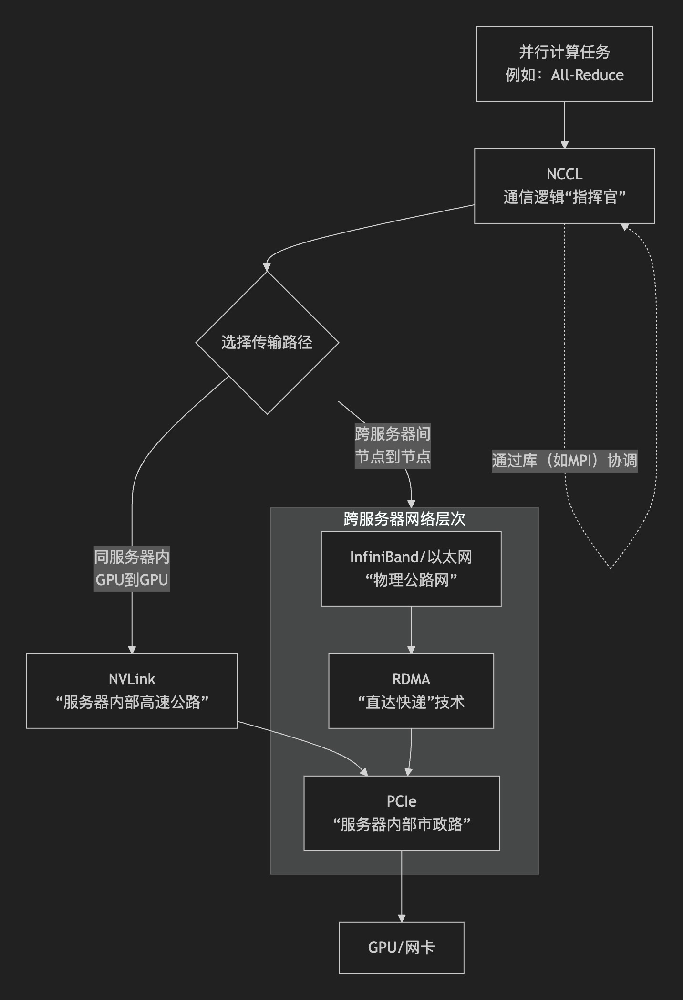

# 卡间通讯

本篇旨在说明多gpu之间的卡间通讯是怎么回事

# NCCL, PCIe, NVLink, Infiniband, RDMA都是什么

如下是他们的关系图

#### 1. NCCL - 通信的逻辑层

- **是什么**：**NVIDIA集体通信库**。这是最顶层的软件库。当你在PyTorch等框架中做分布式训练时，调用`all_reduce`、`all_gather`等操作，底层通常就是NCCL在干活。
- **作用**：它**规划**通信的逻辑——谁在什么时候、发送什么数据给谁。它就像**交通总指挥中心**，负责制定最高效的集体通信方案。
- **关键**：NCCL会**智能地利用底层所有硬件**（NVLink, PCIe, Infiniband）来最大化通信速度。

#### 2. NVLink 与 PCIe - 服务器内部的硬件互联

它们负责**单个服务器（节点）内部**的通信。

在传统的方案中，GPU互联通常采用PCIe，服务器之间互联采用以太网Ethernet。

> PCle（外围组建快速互联），是一种高带宽扩展总线，用于链接显卡，固态硬盘等外围布件

为了实现极限的超高计算密度，英伟达**推出NVLink技术代替传统的PCIe技术**，可提供能够实现出色深度学习所需的通信性能。相较采用PCIe，NVLink技术带宽增加5倍。NVLINK 技术采用了 PCIe Gen4 的高速互连方式，可以提供高达 300 GB/s 的带宽和 1.5 微秒的延迟。

#### 3. InfiniBand 与 以太网 - 服务器之间的物理网络

它们负责**多台服务器（节点间）** 的物理连接。

- **以太网**： 最常见的商用网络技术。传统TCP/IP协议栈有延迟和CPU开销。通过**RoCEv2**等技术，也能支持RDMA。
- **InfiniBand**： **是什么**：一种为**高性能计算和RDMA原生设计**的网络技术。 **特点**：极低延迟、高带宽、高吞吐量。**从硬件层面原生支持RDMA**，是HPC和超大规模AI集群的“黄金标准”网络。

**关系**：两者是物理网络的**两种竞争/并存标准**。Infiniband性能通常更优，但以太网更便宜、更普及。在现代AI集群中，两者都可以用于构建高速节点间网络。

> rdma tcp/ip的相关知识详见[计算机网络.md](../../../basecs/计算机网络.md)

# 瓶颈 -- 解决方案

## 卡间通讯的瓶颈：

- **通信密集操作挑战**：在数据并行和模型并行场景下，GPU间需要高频进行梯度同步、权重聚合，大量的数据迁移导致通讯开销巨大。
- **计算能力与通讯能力不匹配**：GPU计算能力（算力）提升的速度远快于数据传输速度（层间通信能力），这种失衡导致计算单元往往在等待数据，出现显存利用率低的情况。
- **计算气泡 (Pipeline Bubble)**：分布式并行训练中的流水线并行策略容易产生气泡。如果卡间通信延迟大，气泡会变大，设备闲置时间增加，降低训练效率。
- **网络拓扑与拥塞**：在海量卡片互联时，哈希极化（hash polarization）、网络拓扑盲点、流量拥塞抖动等问题会严重阻塞数据流动。

## 解决方案：

### 扩展 Scale-up 域

**核心思想**：与其无限制地增加服务器节点数量（Scale-out，横向扩展），不如先在单台服务器内部做“加法”，将多个计算芯片（如GPU、NPU）通过超高速内部互联技术整合成一个逻辑上更紧密、物理上更一体的计算单元，即“超级节点”。

优化策略就是：NVLINK等硬件的通讯技术，从网络通信的微秒级降至纳秒级。

### 拓扑感知与优化

**核心思想**：在由多个“超级节点”或普通服务器组成的集群中，**网络不是平的**。不同节点之间的“距离”（通信延迟和带宽）可能不同。拓扑感知就是让任务调度和通信库“看见”并“利用”这种物理拓扑的差异，将通信频繁的进程尽量安排在物理上邻近的节点上，并选择最优的通信路径。

**如何实现优化**：

- **调度器层面**：像Kubernetes的调度器或Slurm，可以感知节点所在的机架、交换机层级，在分配任务时，尽可能将需要频繁通信的Pod或进程分配在同一个机架或相邻的服务器上。
- **通信库层面**：NCCL、HCCL等集合通信库会**在初始化阶段探测集群的网络拓扑**，并为之生成一个最优的通信算法和路径规划。例如，对于All-Reduce操作，它会自动选择是使用树形算法、环形算法还是其他混合算法，来匹配当前的物理网络拓扑，实现全局最优的通信效率。

### 模型下沉技术（Ascend/CANN）

**核心思想**：**“不让CPU成为瓶颈”**。传统模式下，GPU/NPU像一个需要被CPU频繁“投喂”数据和“指挥”的副手。模型下沉旨在让计算芯片**更加自主**，减少对宿主CPU的依赖。

**以华为 Ascend/CANN 为例**：

- **传统流程**：CPU负责控制流（循环、条件判断）、数据预处理、任务调度，并频繁调用AI加速卡进行核心计算（矩阵乘、卷积等）。CPU和加速卡之间需要不断同步。
- **模型下沉**： **整图下沉**：将整个AI计算图（包括复杂的控制流、数据预处理算子等）编译成一个完整的、可由Ascend芯片**独立执行**的任务图。 **自主执行**：CPU只需一次性将任务图和初始数据下发到Ascend芯片，芯片便可以**连续执行**，期间仅在必要时与CPU交互，而不是每一步都需要CPU干预。 **动态Shape支持**：先进的模型下沉技术还能支持动态Shape（可变尺寸输入），无需为每种尺寸重新编译或由CPU频繁介入调整。

### 高速网络技术

**核心思想**：当Scale-up（超级节点）和拓扑优化都做到极致后，跨节点的通信依然不可避免。高速网络技术就是为这种**机间通信**提供“高速公路”。

**RDMA**：

- **原理**：**远程直接内存存取**。它允许一台计算机**直接**访问另一台计算机的内存，**无需经过对方操作系统的内核、CPU的参与**。
- **颠覆性改变**： **零拷贝**：数据直接从应用内存到网卡，再通过网络到对端网卡，最后直达对端应用内存，避免了内核缓冲区多次拷贝的开销。 **内核旁路**：通信过程不经过操作系统，延迟极低。 **CPU卸载**：通信操作由网卡硬件处理，CPU几乎不参与，解放了CPU算力。

**RoCE**：

- **是什么**：**RDMA over Converged Ethernet**。即在**以太网**上实现RDMA技术。
- **意义**：传统的RDMA依赖于专用的InfiniBand网络。RoCE使得企业可以利用现有的、更普及和廉价的以太网基础设施，享受到近似InfiniBand的高性能和低延迟。它分为RoCE v1（链路层）和RoCE v2（网络层，可路由）。
- **应用**：在大规模AI集群中，RoCEv2是连接大量计算节点的主流高速网络选择之一，在成本与性能间取得了优秀平衡。配合无损以太网技术，能提供稳定高效的数据传输。

**在AI集群中的作用**：

1. **加速梯度同步**：在分布式训练中，All-Reduce操作需要聚合所有GPU的梯度。RDMA/RoCE能将此过程的延迟和CPU开销降至最低。
2. **加速数据加载**：可以从远程存储节点直接RDMA读取训练数据到计算节点的内存或GPU显存，极大加速数据供给流水线。
3. **实现高效的模型并行**：当单台服务器放不下大模型时，不同层的参数分布在不同的节点上，前向/反向传播时，层与层之间需要高速、低延迟的数据传输，这正是RDMA的用武之地。

# 通信密集操作

在数据并行和模型并行训练中，梯度同步（All-Reduce）和参数交换（All-to-All）等操作频繁发生。这些操作依赖高速互联网络（如InfiniBand），但在跨节点场景下，带宽限制和延迟问题显著影响整体吞吐。

- 梯度聚合时，All-Reduce操作的时间随GPU数量线性增长
- 在张量并行中，层内计算需多次跨设备通信，增加等待时间
- 高带宽需求导致网络拥塞，降低有效计算利用率

| 通信模式   | 典型操作        | 通信频率 | 带宽敏感度 |
| :--------- | :-------------- | :------- | :--------- |
| 数据并行   | All-Reduce      | 每步一次 | 高         |
| 张量并行   | All-to-All      | 每层多次 | 极高       |
| 流水线并行 | Micro-batch传输 | 逐微批次 | 中         |

# gpu中操作

**通信模式对比表**

| 操作              | 输入                        | 输出                            | 带宽成本   | 应用场景     |
| ----------------- | --------------------------- | ------------------------------- | ---------- | ------------ |
| **Broadcast**     | 根进程有 M 数据             | 所有进程有 M 数据               | M          | 参数初始化   |
| **AllReduce**     | 每个进程有 M 数据           | 所有进程有归约后的 M 数据       | 2M*(N-1)/N | 梯度同步     |
| **AllGather**     | 每个进程有 M 数据           | 所有进程有 N*M 数据             | M*(N-1)    | 收集所有特征 |
| **ReduceScatter** | 每个进程有 N*M 数据         | 每个进程有 M 数据（归约后分片） | M*(N-1)    | ZeRO 分片    |
| **All-to-All**    | 每个进程有 N*M 数据（分块） | 每个进程重新排列的 N*M 数据     | 2M*(N-1)   | 张量并行转置 |