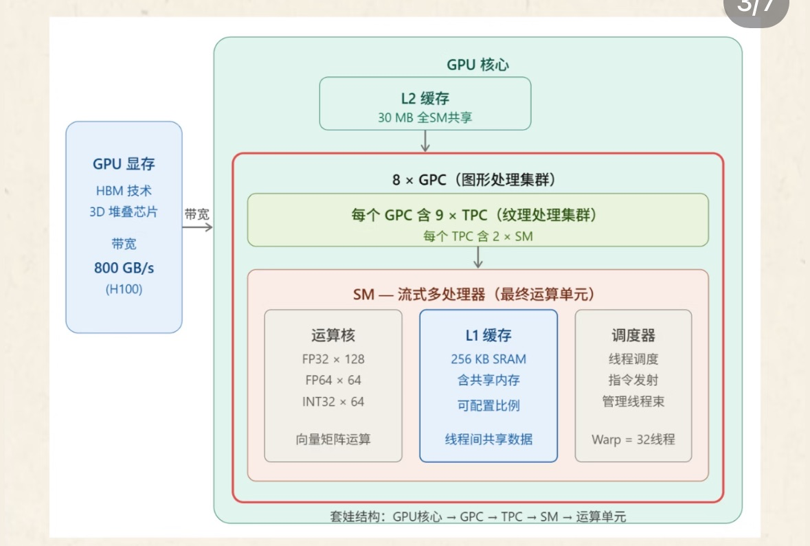

# 算子

相较于CPU ，GPU往往更适合大模型的训练

内存 显存

## Gpu内部结构



其中SM是执行响亮运算的地方，所有KV，Q/K/V的矩阵计算都在这里

<u>**关键概念**：</u>

DMA（直接内存访问）：CPU不需要亲自搬运数据，发出指令让硬件自动完成数据在磁盘，主内存，GPU之间的搬运；cpu可以去干别的事情

HBM（高带宽内存）：GPU显存的3D堆叠技术，本质是把多块内存芯片叠成正方体，<font color='red'>增大了GPU核心的接触面积</font>，从而大幅提升传输带宽。H100可达800GB/s(显存带宽)

CPC（图形处理集群）：本身不做运算，他是一个组织管理单元，把一批SM打包在一起统一调度

L2缓存 在GPU推理中扮演一个中转站的角色。充当显存和所有SM之间的共享缓冲区

​	eg：当某个SM需要模型参数时候，会先看L2缓存里是否有，有的话直接拿<font color ='red'>（缓存命中）</font>，比从显存中读快得多。如果没有，才会从显存中把数据搬进L2，<font color='red'>同时存一份</font>


# 额外题目

## GPU matrix transpose使用shared memory的好处

## CPU按列遍历一个行优先的矩阵相比按行遍历为什么性能会变差，具体是因为哪个性能指标变差导致的

在 C、C++ 等语言中，矩阵默认采用 “行优先存储”，即内存中数据按 “一行接一行” 的顺序连续排列。例如一个 3×3 矩阵：

```
矩阵逻辑结构：        内存物理布局：
a[0][0] a[0][1] a[0][2]  →  a[0][0] → a[0][1] → a[0][2] → a[1][0] → a[1][1] → a[1][2] → ...
a[1][0] a[1][1] a[1][2]
a[2][0] a[2][1] a[2][2]
```

这种布局决定了：**按行访问是 “连续内存读取”，按列访问是 “跳跃式内存读取”**。

现代 CPU 为解决 “CPU 运算速度远快于主存访问速度” 的矛盾，设计了多级缓存（L1、L2、L3），核心依赖 “缓存行（Cache Line）” 机制工作：

1. **缓存行的加载规则**：CPU 访问内存时，不会只读取单个数据，而是将该数据所在的 “缓存行”（通常 64 字节）整体载入缓存。例如访问`a[0][0]`时，`a[0][0]`到`a[0][15]`（假设 int 占 4 字节）会被一次性加载到 L1 缓存中。
2. **按行遍历：高缓存命中率**：当按行访问（`i`为行索引，`j`为列索引）时，`a[i][j]`之后的`a[i][j+1]`、`a[i][j+2]`等数据已在缓存行中，后续访问无需再读取主存 —— 缓存命中率可接近 90%，大部分操作直接在高速缓存中完成，延迟极低。
3. **按列遍历：低缓存命中率**：当按列访问（`j`为列索引，`i`为行索引）时，`a[i][j]`之后的`a[i+1][j]`在内存中相隔一整行（例如 3×3 矩阵中，`a[0][0]`和`a[1][0]`间隔 3 个数据），必然跨缓存行。此时每次访问都需要重新从主存加载新的缓存行，缓存命中率可能降至 50% 以下，甚至更低。