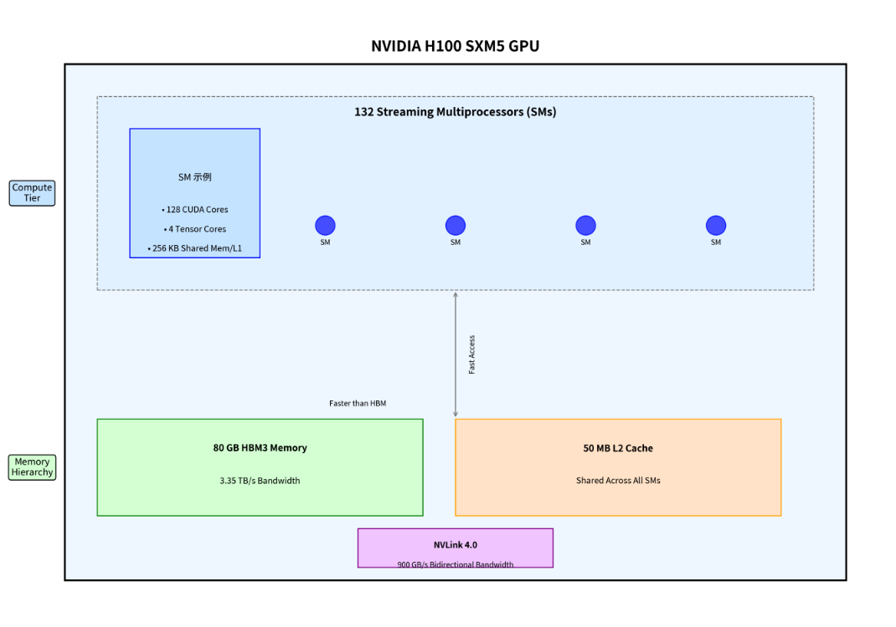
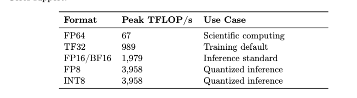
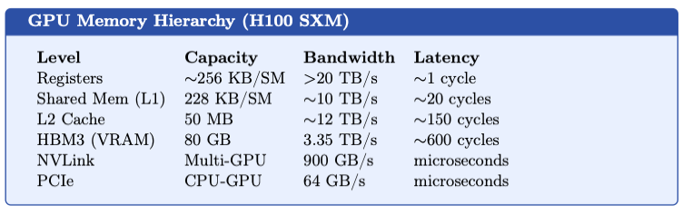
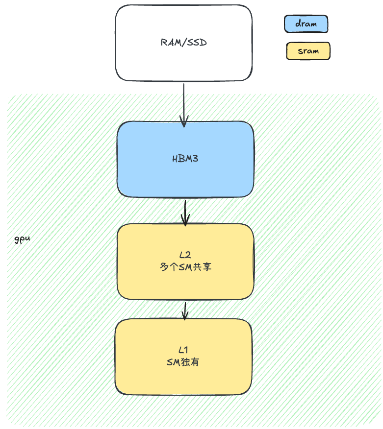
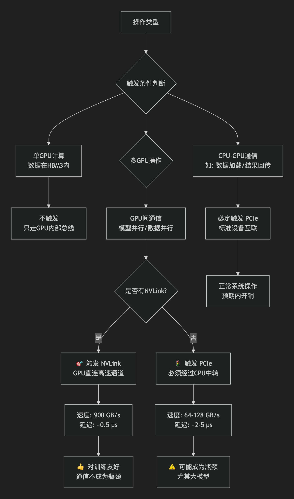
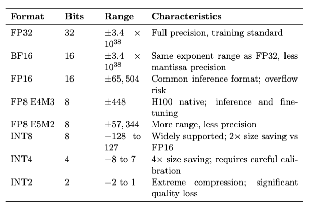

# Efficient LLM inference

# Chapter 1 the inference problem

## train & inference （contains base theotical）

训练阶段：吞吐量是最终的指标（希望每秒钟可以吞吐更多的tokens）而比较反直觉的是，单次前向传播的时间反倒是无关紧要的，这时候大家比较关注的是整体的训练时长（以天或周为单位）

> trianed：Throughput is the supreme metric: we want to process as many tokens per second as possible, amortized across the training run. Latency of an individual forward pass is largely irrelevant — what matters is overall training time measured in days or weeks.

推理阶段：由于参数层是完全冻结的，所以目标是：去做一个transformer操作得到outputs尽可能的快和便宜

> Inference is the mirror image. Here the model parameters are frozen. The task is to compute a forward pass — transforming an input prompt into a predicted output — as fast and cheaply as possible, for each individual request, often from real users who are waiting for a response.

❓为什么训练阶段要关注吞吐量这个指标

因此，训练和推理有三个不同的指标面向截然相反的标准：

1. 吞吐量的延迟
2. 高效记忆
3. 每次请求的话费


推理阶段生成token的过程是一个自回归过程（Autoregressive loop），整个过程可以拆分为prefill 和 decode

```
The Autoregressive Generation Loop
1. 得到一个prompt（一个token序列）
2. 执行 prefill 前向推理操作，此时会对整个input token 序列进行一个并行计算操作，同时计算出 attention 的 keys 和 values 并将他们储存下来
3. 自回归decode操作：每一步，喂给他们上次生成的token作为输入，并利用kv cache进行attenion计算操作，采样得到下一个token
 4. 重复操作3，直到生成 <EOS>	或者 达到最长限度
```

因此，prefill是一个计算密集问题（compute-bound，并发计算所有tokens attention 完全依赖于gpu tensors cores）而decode是内存宽带密集问题（memory-bandwidth-bound，每次只能计算一个token，但是需要从gpu 内存中加载全部kv cache）

> 指的是模型权重从GPU 显存（HBM）至 GPU 计算核心，粗略计算一个7billion的 16-bit精度的模型，model weights = 7 * 10^9 *(16/8)bytes = 14GB if use Nividia A100 ,which has 2TB/s HBM bandwidth, time_cost = 14GB/2TB = 7ms
>
> 因此，batchsize的调高可以让更多的request同时去读权重，这样可以提高throughput

推理阶段指标：Latency，Throughput 和 Cost（为铁三角问题）

- Latency：

  **定义：**请求完成时间--分为：1. TTFT: 第一个token返回的时间 2. TPOT : 输出完成时间

  **优化操作：**降低模型大小，提升batchsize，使用speculative decoding（投机操作），优化kv cache

- Throughput：

  **定义：**所有并发用户每秒生成的 Token 数量

  **优化操作：**提升batchsize，使用continuous batching，tensor parallelism

  区分概念：FLOPS：完成计算所需的浮点运算总数

- Cost：

  **定义：**1M tokens生产所需的USD

  **优化操作：**量化模型，使用更高效的服务框架，优化硬件利用率

> The iron triangle manifests concretely: maximizing throughput requires large batch sizes, but large batches increase per-request latency. 
>
> Minimizing latency often requires serving requests individually, which wastes GPU utilization and increases cost. 
>
> Inference engineering is the art of navigating these tradeoffs intelligently for your specific application requirements.


## The Roofline Model

一个基础模型决定他是计算密集型还是存储密集型

> The Roofline model provides a clean framework for understanding whether a given operation is compute-bound or memory-bound.

\[
\text{Achieved Performance (FLOP/s)} = \min\left(\ \text{Peak FLOP/s},\quad \text{Arithmetic Intensity} \times \text{Peak Bandwidth (Byte/s)}\ \right)
\]

**关键参数**

*   **Arithmetic Intensity (算术强度)**: 定义为 **FLOP/Byte**，即算法**每从内存中访问一字节数据，平均可执行多少次浮点运算**。(矩阵乘法运算 = 2FLOPS/byte)
*   **Peak FLOP/s (理论峰值算力)**: 硬件在单位时间内可完成的最高浮点运算次数。
*   **Peak Bandwidth (理论峰值带宽)**: 内存系统在单位时间内可传输数据的最大字节数。

# Chapter 2 Hardware Foundations for Inference

## gpu 架构

gpu具有一个层次型架构，以 NVIDIA H100 SXM5 为例：

- 132 Streaming Multiprocessors （SMs）：= 128 CUDA + 4 Tensors Cores
- 80 GB HBM3 memory with  = 3.35 TB/s bandwidth. 
- A shared memory / L1 cache of 256 KB per SM, orders of magnitude faster than HBM.
- An L2 cache of 50 MB shared across all SMs.
- NVLink 4.0 providing 900 GB/s bidirectional bandwidth for multi-GPU communication.



## Tensor Cores and Mixed Precision

Tensor Cores 是专用的矩阵乘法单元，用于对低精度格式的操作数的小块（例如 16 × 16 × 16）执行运算。



推理阶段可以利用比训练阶段更低的精度，因为我们仅需保持前向传播的保真度——无需进行高精度的梯度累积。正因如此，INT8 和 FP8 推理能够达到 FP16 的理论峰值吞吐量。

> 如何解释这部份---INT8 和 FP8 推理能够达到 FP16 的理论峰值吞吐量。
>
> ```
> 假设一个Tensor Core周期：
> ───────────────────────────────────────
> FP16模式： 执行 1 次 4×4×4 矩阵乘法
>           输入：FP16  (16位)
>           输出：FP16
>           每周期：64次乘加 → 128 FLOP（64 * 2）
>           吞吐量 = 1单位
> 
> INT8模式： 执行 1 次 8×8×8 矩阵乘法
>           输入：INT8  (8位)
>           输出：INT32（内部累加）
>           每周期：512次乘加 → 1024 FLOP（512 * 2）
>           吞吐量 = 8单位（相比FP16） = 1024 / 128 理论上是8倍
> ───────────────────────────────────────
> 实际：INT8吞吐量 ≈ 4× FP16（非理论8×，因需量化/反量化开销）
> ```


## Memory Hierarchy and Bandwidth

需要理解数据存储在哪里 --- 存储框架层次结构 

> --从上到下依次： **容量越来越大**；速度越来越慢（延迟越来越高）
>
> 数据全部存放在HBM3上，然后程序员会通过各种手段，企图将数据留存在L1和L2的地方上，然后计算触发时就会判断，如果



- **Registers（寄存器）** 是**速度最快、容量最小、离计算核心最近**的存储层级。




**触发NVLINK 和 Pcle，这时候需要多个gpu中间进行通信**



## CPU and Edge Hardware

CPU 推理对于延迟敏感型应用、本地部署以及成本优化至关重要：

- Modern CPUs for inference use AVX-512 VNNI (Vector Neural Network Instructions) to perform INT8 matrix-vector multiplications e"ciently. Intel’s 4th-gen Xeon Scalable processors can deliver 10 TFLOP/s of INT8 throughput, suffcient for small models.

- Apple Silicon (M3 Ultra) unifies CPU and GPU memory **into a single pool** (up to 192GB) with 800 GB/s bandwidth. This unified memory architecture makes it exceptionally good for inference on large models that would otherwise require multiple discrete GPUs.

- Qualcomm Hexagon DSPs and NPUs in mobile SoCs are purpose-built for low-power neural network inference, delivering several TOPS (Tera-Operations Per Second) at milliwatt power budgets.

## Emerging Hardware Trends

• Google TPU v5p: Custom matrix engine with inter-chip interconnects enabling pods of thousands of chips for large-model inference.  ---可以定制矩阵单元大小，interchip使得多个芯片处于超平面上

• Groq LPU: Deterministic inference accelerator with no DRAM — all weights stored in on-chip SRAM, enabling 500 token/s per chip with ultra-low latency.

• Cerebras WSE-3: Wafer-scale engine with 44 GB of on-chip SRAM, eliminating the HBM bottleneck entirely for models that fit.

• Photonic computing: Early-stage technology using light instead of electrons for matrix multiplication, promising dramatically lower power consumption.


# Chapter 3 Transformer Inference Mechanics

## Transformer前向推理

一个标准的transformer操作，需要通过 $L$层，每一层都包含两个：MHA（multihead attention）block & FFN（Feed-Forward Network），each followed by layer normalization and a residual connection

> 假设：长度为 n 的 input tokens，模型维度 d
>
> 1. Embedding：map token ids to $X ∈ ℝ^{n×d}$
> 2. For each layer
>    1. compute q, k, v 
>    2. compute attention 
>    3. Apply FFN with gate
> 3. Language model head: Project to vocabulary logits and sample  投影至词汇 Logits 并进行采样

## 理解 kv cache

问题：每一次进行decode操作中的自回归时候，都需要对之前所有的token重新去计算一轮k和v，消耗为an O(n2) cost in the sequence length.

kv cache的存在主要解决了：在prefill阶段之后，我们为**每个已处理的 Token 存储每一层**的键（Key）和值（Value）矩阵，并在随后的解码步骤中对其进行复用。

单序列 KV cache 内存占用：
$$
Memory = 2 \times L \times n \times heads \times d \times bytes
$$
 **参数序列**

- L：层数
- n：序列长度
- heads：注意力头数
- d：模型维度
- bytes：FPx ，x/8

> For LLaMA-2 70B (80 layers, 64 heads, 128 head dim, FP16, 4096 context):
>
> 2 * 80 * 4096 * 64 * 128 * 2  ≈ 10.7 GB

巨大的记忆量和，使得KV cache的管理十分重要

## Prefill vs. Decode: Two Very Di!erent Workloads

Prefill阶段：利用gpu tensor core 并发进行矩阵乘积操作，将矩阵维度从[n,d]->[d,4d]

> **Prefill phase**：Processes all n prompt tokens in a single forward pass in parallel. The dominant operation is GEMM (General Matrix Multiplication) of shape [n, d] → [d, 4d] for the FFN layers. This is compute-bound for long prompts (large n), achieving high GPU utilization on Tensor Cores.

Decode阶段：进行一个单一维度的矩阵计算，每次只进行一个token的 [1,d]->[d,4d]

> **Decode phase：**Processes one token per step. The dominant operation is GEMV (General Matrix-Vector Multiply) of shape [1, d] → [d, 4d]. This is memory-bandwidth-bound: we load～140 GB of weights (for a 70B model in FP16) per step to perform a trivially small computation. GPU utilization of Tensor Cores is typically <10%.

在解码阶段，模型加载速度的关键影响因素之一在于 KV Cache 的规模。为了在保持模型表达能力的条件下有效控制参数生成量，相关研究聚焦于注意力机制的优化，目前已有以下主要方向：

- MHA：标准的多头注意力
- MQA：all query share single set of kv cache
- GQA：为了减缓MQA导致的表达力下降，因此就是将其分为G个组，每一组共享一个kv cache
- MLA：DeepSeek-v2中介绍的，将k和v映射到一个低维度空间，然后存这个低维度的kv xache，相较于MHA只有轻微的性能下降

​		
$$
\text{kv cache size ratio}：MHA：GQA：MLA ≈ 8 ：2 : 1
$$

## Positional Encodings at Inference Time

RoPE(Rotary Positional Embeddings)是针对decoder-only LLMs当下主流的位置编码范式

> decoder-only：xxxx
>
> 

RoPE将KV cache旋转一个角度到一个超平面
$$
q_m = q · e^{im\theta}\\
k_n = k · e^{in\theta}
$$
so that  $<q_m, k_n>$ depends only on the relative position $m-n$. ==At inference time, RoPE allows context length extrapolation via **NTK-aware scaling** or **YaRN,** enabling models trained on 4K context to generalize to 128K contexts with appropriate position interpolation.==

详细详解见：


# Chapter 4 Quantization

为什么做量化：由于一个全量FP32 的 70B 模型需要280GB的gpu 内存，大多数显卡已无法满足该想需求，但是讲模型从FP32 降低到INT8就只会需要70GB（对于H100可以全部存放在HBM3上），量化直接决定模型是否可以成功部署

**不同类型的数字格式使用场景**



## Post-Training Quantization Methods 训练后量化方法

具体结论详见 [Quantization.md](../Quantization/Quantization.md)

### GPTQ

GPTQ是一种逐层二阶 PTQ 方法。他是逐行进行量化，利用逆Hessian矩阵，更新剩余权重以补偿已量化权重的量化误差。
\[
\varpi = \frac{\mathbf{W}_{:,\:q} - [\mathbf{H}^{-1}\mathbf{F}]_{:,\:q}}{[\mathbf{H}^{-1}\mathbf{F}]_{q,\:q}}
\]

### AWQ

AWQ认为若有权重并非同等重要，所以给每一个权重一个参数，进行一个缩放

### QuIP# and AQLM

QuIP#采用非相干处理技术——即在量化前随机旋转权重与激活值——以平坦化数值分布，从而实现近乎无损的2比特量化。

AQLM (Additive Quantization of Language Models)采用一种基于码本的方法，将权重向量编码为码本条目的求和，从而实现了相当于 2 比特的压缩效果，且其质量更接近于 4 比特的方法。

## Quantization-Aware Training (QAT)

PTQ 方法基于小规模数据集进行校准，并采用事后量化策略，这限制了其精度恢复能力。相比之下，QAT 在微调阶段将伪量化算子嵌入到了前向传播过程中

> **为什么需要校准**：直接将训练好的模型进行量化，往往会因为数值范围变化（尤其是从浮点到定点数）导致精度严重下降。校准的目的就是找到最优的量化参数（主要是**缩放因子** 和**零点**），使得量化后的数值分布能最好地匹配原始浮点数值的分布，从而最小化精度损失。
>
> 
>
> **“基于小规模数据集”**：这个校准过程**不需要**使用庞大的原始训练集。它只需要一个**很小的、有代表性的数据集**（通常几百到几千个样本，与训练集同分布）。模型在这个小数据集上运行一遍前向传播，统计各层权重和激活值的**动态范围**（最小值和最大值）或**分布**，然后据此计算量化参数。

## 量化的挑战

虽然权重量化相对直接（权重是静态的，其分布可在离线状态下进行分析），但激活量化要困难得多。激活值的动态范围随输入的不同而变化；此外，大型语言模型（LLMs）==还表现出一种有据可查的现象：少数通道（即“离群值”）的激活幅值要比典型通道高出 100 倍甚至更多。==若简单地将激活值量化为 INT8 格式，量化比例尺将不得不迁就这些离群值，从而导致处于正常范围内的激活值全部坍缩，最终仅剩下寥寥几个离散数值。
针对这一问题的解决方案包括：
• LLM.int8()（Dettmers 等人）：对矩阵乘法进行分解，将离群通道保留为 FP16 格式，其余通道则量化为 INT8 格式。
• SmoothQuant：通过逐通道缩放操作，将量化的难点从激活值转移至权重端，其公式为：Y = (X · diag(s)⁻¹) · (diag(s) · W)。
• FP8 激活：相较于 INT8，FP8 拥有更宽广的动态范围，因此能够自然地容纳并处理这些离群值。

# Chapter 5 Speculative Decoding 投机解码

推测解码（Leviathan et al., 2023; Chen et al., 2023）的核心在于利用模型推理中的一种关键不对称性：**验证一个候选词元序列是否符合大型模型的预期，仅需一次并行的前向传播；而若以自回归方式逐一生成这些词元，则每个词元都需独立执行一次前向传播。**

```
整体流程如下：
1. 使用一个小的模型（7B模型）来自回归逐个预测K个对象，也就是我根据previous 先生出来k个后续[output_1,\dots,output_k]
2. 然后用大模型并行验证K个词源，意思
	parallel1: 验证previous->output_1
	parallel2: 验证previous+output_1->output_2
	....
	parallelk: 验证previous+output_1+.....output_k->output_k
	这会带来以下几种情况：
		最好的情况是：一下接受k个词源，加速k倍
		最坏的情况是，一个没接受，但他同时也把第一个output_1‘也算出来了，也就是没有加速

```

理论上，加速比 = $\frac{1}{1-\alpha^K}$ ，其中$\alpha$是每一个token的接受率

## Token Tree Verification 树型验证

基础的推测解码生成单个草稿序列。基于树结构的推测解码则生成一棵草稿序列树：在每一个位置上，草稿模型提出多个候选词元，从而构建出一种分支树状结构。

> Basic speculative decoding generates a single draft sequence. Tree-based speculative decoding generates a tree of draft sequences: at each position, the draft model proposes multiple candidate tokens, creating a branching tree structure. 

## Medusa: Multi-Head Speculative Decoding

**传统推测解码的瓶颈**：需要维护**两个独立的模型**——一个大型的“目标模型”和一个小型的“草稿模型”。这会带来额外的内存开销和复杂度。

**Medusa 的创新**：**不再需要独立的草稿模型**。它直接在**目标大模型**（就是你想要使用的那个主力模型，比如LLaMA-70B）的顶层，额外添加了 **K 个轻量的“Medusa 头”**。

> 相当于本来预测一步，预测n步，步数的扩大会导致模型性能下降

## EAGLE: Effcient Autoregressive Generation

解决上述预测多步导致的性能下降

EAGLE 的核心思想是：**为了让预测更准，草稿模型需要看到更丰富的信息**。

它不再像 Medusa 那样只用“当前思考快照”，而是训练了一个**轻量级的草稿模型**，这个模型的输入包含两部分：

1. **隐藏状态**：模型当前的上下文表示（相当于“思考快照”）。
2. **已生成词元的特征嵌入**：**之前具体生成了哪些词**的向量表示。---lstm利用ht-1

好的，我们来用更清晰的方式解释 EAGLE 这项技术解决了什么问题，以及它是如何改进的。

------

### 核心问题：Medusa 的局限性

Medusa 直接从模型的**最后一个隐藏状态**来预测未来的多个词元。这相当于只用模型“**当前的思考快照**”去猜接下来好几步的内容，**丢失了之前生成的具体词元序列信息**。就像你只记得此刻在想什么，但不太确定刚才具体说了哪几个词，去猜接下来要说的句子就容易出错。

这导致其生成的候选序列准确性有限，最终被大模型“接受”的比率不够高，从而限制了加速效果。

------

### EAGLE 的解决方案

EAGLE 的核心思想是：**为了让预测更准，草稿模型需要看到更丰富的信息**。

它不再像 Medusa 那样只用“当前思考快照”，而是训练了一个**轻量级的草稿模型**，这个模型的输入包含两部分：

1. **隐藏状态**：模型当前的上下文表示（相当于“思考快照”）。
2. **已生成词元的特征嵌入**：**之前具体生成了哪些词**的向量表示。

**类比**：

- **Medusa**：相当于你只凭“刚才聊到科技话题”这个感觉，去猜我下一句要说什么。
- **EAGLE**：相当于你不仅知道“刚才聊到科技”，还清楚记得我最后说的几个词是“大语言模型的推理”，然后基于此来预测我下一句。显然，后者准确度会高得多。

通过利用更丰富的输入信息，EAGLE 的草稿模型能做出**准确得多的下一个词元预测**，从而大幅提高了候选序列的接受率。

------

### EAGLE-2 的进一步创新：动态草稿树

EAGLE-2 在此基础上，引入了一个关键优化：**动态草稿树**。

1. **传统方法（静态树）**：通常固定地预测一个“分支因子”和“深度”，比如每次猜2个分支，猜3步。这种“一刀切”的策略不够灵活。
2. **动态草稿树**：它会**根据草稿模型预测的“置信度”来动态调整树的结构**。 如果模型对某个后续词的预测**置信度很高**，它就可能沿着这个路径**多探索几步**（增加深度）。 如果预测**置信度一般**，它可能**提前剪枝**，不浪费计算资源在低概率的路径上。 这就像一个聪明的搜索策略，把有限的“猜测”资源集中在最有可能正确的路径上。

**结果**：这种动态适应性使得 EAGLE-2 在**代码生成和推理任务**上，实现了 **3到4倍的推理速度提升**。

## Speculative Decoding什么时候有用，什么时候没用

- 单流、低延迟服务：在批量大小（Batch Size）为 1 的情况下，目标模型的计算资源利用率往往偏低；投机解码技术能够分摊并利用这些闲置的计算资源。
- 高接受率：对于输出具有可预测性的任务（例如代码补全、结构化生成、事实性问答等），该技术能实现较高的接受率（ϱ值）及显著的加速效果。
- 充足的 GPU 显存：需要预留足够的显存空间，以同时容纳草稿模型（Draft Model）和目标模型（Target Model）。
- 在 GPU 资源已处于饱和状态的高批量（High-batch-size）服务场景下，推测解码（Speculative Decoding）无法带来任何吞吐量上的提升。它是一项针对延迟而非吞吐量的优化技术。

# Chapter 6 KV Cache Optimization

对于一个处理数百个并发请求的服务系统而言，简单地预分配最大长度的 KV 缓存会浪费大部分已分配的内存（因为实际请求的长度是不可预测的），并严重限制批处理规模。

> ### 那么，为什么要“预分配”KV缓存？
>
> 预分配主要出于**性能和实现简洁性**的考虑：
>
> 1. **内存管理效率**： 提前申请一大块连续的显存空间，比在生成过程中频繁地重新分配、复制内存要高效得多。碎片化和分配延迟会严重影响性能。
> 2. **确定性**： 服务系统需要保证稳定性。预分配可以确保在请求处理开始前，就拥有所需的所有资源，避免在生成中途因内存不足而失败。
> 3. **硬件友好**： 连续的显存空间对内核操作（如cuBLAS中的矩阵计算）更友好，有助于提升内存带宽利用率和计算效率。
>
> **一个简单的预分配策略**： 为每个请求分配一个固定大小的缓存块，其长度等于**模型允许的最大上下文长度**（例如，Llama-3是128K，GPT-4是128K）。

## PagedAttention

vllm 通过pagedattention，将操作系统中的虚拟内存概念应用于 KV 缓存管理。

与为每个请求的 KV 缓存分配一块连续内存不同，PagedAttention 将 KV 缓存划分为固定大小的块（即“页”），每块包含 B 个 Token。一个“块表”负责将每个请求的逻辑 KV 缓存位置映射到 GPU 内存中的物理块——这些物理块无需在内存中连续排列。

**PagedAttention 的关键特性**
• 无预分配：内存块随着生成过程的推进按需分配。
• 无内部碎片：浪费的内存量在每个请求中至多仅为 (B-1) 个 Token。
• 写时复制：共享相同前缀（例如系统提示词）的多个请求可以共享物理内存块，直至其生成路径发生分歧。
• 灵活的逐出机制：属于某个请求的内存块可被交换至 CPU 或磁盘，从而为其他请求腾出空间。


## 如何可以使用更少的内存呢

1. 前缀缓存 This can reduce prefill cost by 90%+ when the prefix is long relative to the user prompt.

2. StreamingLLM: The Attention Sink Phenomenon

> 针对多轮对话，或者很长的agents，无法储存全部的kv cache。我们很容易想到利用一个窗口滑动不停减少kv cache的量，但是这会导致一个注意力偏移性能大幅降低，使得他失去对之前东西的理解。研究发现，大型语言模型（LLMs）会形成所谓的“注意力汇聚点”（attention sinks）：序列开头的少数几个词元（无论其语义内容如何）在所有层级中都会获得远超正常比例的注意力分数。一旦移除这些词元，模型的内部表征便会遭到破坏。
>
> StreamingLLM（Xiao 等人，2023）提出了一种解决方案：它在保留近期词元滑动窗口的同时，额外保留一小部分作为“汇聚点”的初始词元（通常为 4 个），从而在内存占用受限的前提下，实现了无限长度的 LLM 推理：

3. KV cache 量化

> 目前，在 TensorRT-LLM 和 vLLM 等框架中，INT8 KV 缓存量化已成为标准配置，能够实现约 2 倍的 KV 内存占用缩减。更为激进的量化方案则通过精细的“逐头”（per-head）或“逐通道”（per-channel）缩放策略，将 INT4 甚至 FP8 精度应用于 KV 缓存。

# Chapter 7 Kernel Engineering and FlashAttention

为什么要自定义cuda内核：

像 PyTorch 这样的高级框架通过库原语来组合各类操作：例如，一个线性层实际上是对 `torch.nn.Linear` 的调用；该调用随后会调用 cuBLAS 来执行 GEMM 运算，接着将结果写入 HBM，随后又将其读回以供下一个操作使用。这种“即时执行”（Eager Execution）模式会为中间张量产生巨大的 HBM 流量，而这些张量原本完全可以保存在高速的片上存储器中。

内核融合（Kernel fusion）将多个操作合并为一个单一的 GPU 内核，通过将中间结果保存在寄存器或共享内存中，从而避免了 HBM 的往返存取。对于一个融合了 LayerNorm、Linear 和 GeLU 的内核，相比于使用三个独立内核的方案，我们成功将 HBM 流量降低了三分之二。

## FlashAttention: 


# Chapter 8 Serving Systems Architecture

一个推理服务的范式：

- Fronted / API Gateway：接受https的请求，进行资格教研，流量限制和排队
- Scheduler 调度：服务系统的大脑，决定该请求是否应该在这一个batch中，管理gpu内存和SLO限制

> ​	SLO：服务系统的评价指标，他有三个铁三角指标：
>
> - **SLI（Service Level Indicator，服务等级指标）**：延迟 可靠性 吞吐量 质量
> - **SLO（Service Level Objective，服务等级目标）**：延迟SLO：`p99 延迟 < 200 毫秒`。可用性SLO：`服务每月可用性 >= 99.95%`。质量SLO：`LLM输出的事实错误率 < 2%`
>
> - **SLA（Service Level Agreement，服务等级协议）**：

- Execution Engine：进行gpu前向操作，管理kv cache
- Tokenizer：编码
- Sampler：采样

## Batching 策略

**Static Batching**：最简单的方法是：收集固定数量的请求，将它们全部填充（padding）至其中最长序列的长度，然后对这一填充后的批次进行处理。这种做法效率极低：填充操作所浪费的计算资源和内存，与序列长度的方差成正比。

**Continuous (Iteration-Level) Batching**
