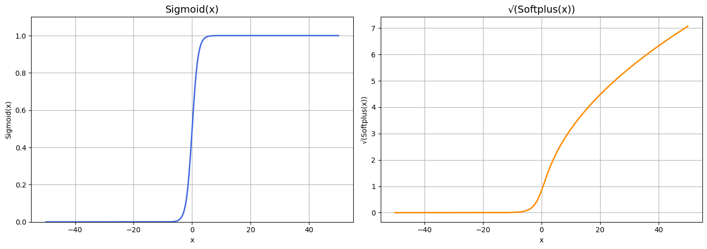
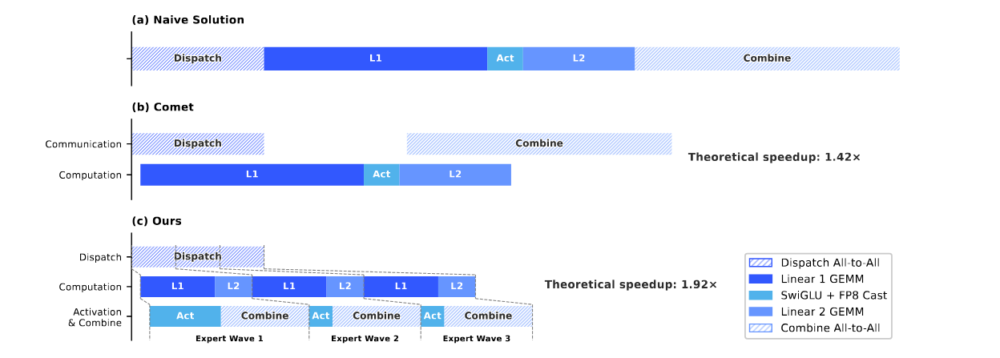

# DeepSeek

## 核心亮点

Transformer + MTP

# DeepSeek-V4: Towards Highly Efficient Million-Token Context Intelligence

## 摘要

deepseek 4 主要提供了两个版本，均能支持1M上下文

|    模型     | 总参数 | 激活参数 | 上下文长度 |
| :---------: | ------ | -------- | ---------- |
|  ds v4 pro  | 1.6T   | 49B      | 1M         |
| ds v4 Flash | 284B   | 13B      | 1M         |

为了增强长文本效率 -> CSA（compressed sparse attention）/ HCA (Heavily Compressed Attention)

增强残差链接，也就是防止信息丢失 -> mHC (Manifold-Constrained Hyper-Connections)

训练方法：muon optimizer -> 替代原有Adam

**效果（1M token上下文设置下，相较于ds32）：**

1. pro ：仅需27% 的单token 推理FLOPs 和10% 的KV cache
2. Flash ：仅需10% 的单token 推理FLOPs 和7% 的KV cache

> [!CAUTION]
>
> 单token的flops：decode过程中计算出一个token所需要的计算


## 模型权重长这样


## FOCUS

### Q1: CSA HCA 和 mHC

- CSA compressed Sparse Attention，主要做了几件事情：

  1. 压缩了前后8个位置的kv, 得到一个$C^{comp}$, 如果是0号位置前面没有序列就补零, 压缩率是1/m 

     ```
     [key1, key2, key3,..., keym]*Za + Ba
     [key2, key3, key4,...,keym+1]*Zb + Bb
     				|
     				|
     				C2		
     ```

  1. 拿到压缩后的$C^{comp}$，会拿到topk的kv进行核心计算， 针对indexer keys 计算同样的压缩率，然后对q降纬处理

  

- HCA Heavily compressed Attention 是一个非overlapped 压缩
- mHC 是在HC上的一种进化，也就是将残差映射到特定的流上，为了稳定信息传输

$$
HC的公示：X_{l+1} = B_l X_l + C_l F_l ( A_l X_l) \\
MHC 对其中的B_l 进行约束，让其大于0 的同时横竖和都为一
$$


### Q2：如何实现10%的kv 压缩率

压缩率是1/m，kv 两个就是1/2m 

### Q3: single-token inference Flops 

### Q4: 相较于ds v3 有哪些创新

- experts 和 routed experts中的激活参数从Sigmoid(x) 换成Sqrt(Softplus(x))

​		Sqrt(Softplus(x)) 对于正数字等比缩放	

```python
# Sigmoid
sigmoid = 1 / (1 + np.exp(-x))

# Softplus
softplus = np.log1p(np.exp(x))  # 数值稳定
sqrt_softplus = np.sqrt(softplus)
```



- 对于DeepSeek-V4，我们取消了对路由目标节点数量的限制，并仔细地重新设计了并行策略以保持训练效率。
- 与 DeepSeek-V3 相比，采用哈希路由的 MoE 层替换了最初几个 Transformer 块中的密集 FFN 层

### Q5: 他的创新对于推理引擎有哪些挑战

1. 对于不同的条目采用不同的精度存储形式  对于缓存池有不同的需求

   “First, we adopt a mixed storage format for KV entries: BF16 precision is used for the rotary positional embedding (RoPE) dimensions, while FP8 precision is applied to the remaining dimensions. This hybrid representation reduces the KV cache size by nearly half compared with pure BF16 storage. Second, attention computation within the lightning indexer is performed in FP4 precision, which accelerates the attention operation under extremely long contexts. Third, relative to DeepSeek-V3.2, a smaller attention top-k is chosen in DeepSeek-V4 series, thereby improving model efficiency on short- and medium-length texts. Finally, and most importantly, compressed attention and hybrid attention techniques substantially reduce both the KV cache size and the computational FLOPs” (DeepSeek-AI 等, 2026, p. 13)

> [!TIP]
>
> |        组件        | 精度 |
> | :----------------: | :--: |
> |        ROPE        | BF16 |
> |      其余纬度      | Fp8  |
> | Lightening indexer | FP 4 |
> |                    |      |
> |                    |      |

2. EP 对于 通讯有更高的要求

   每个moe层分为四个阶段：

   - 通信限制：Dispatch， combine
   - 计算显示：L1，L2


